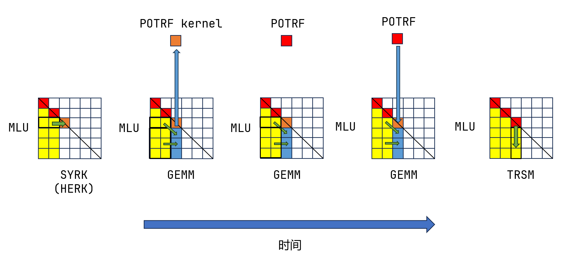
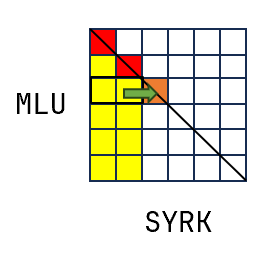
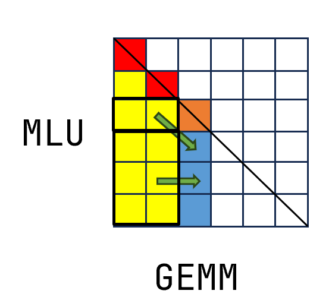
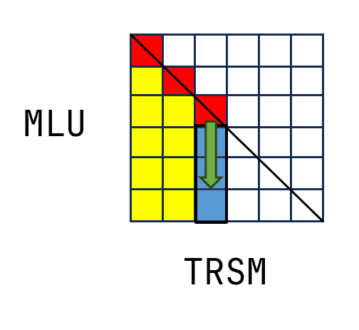
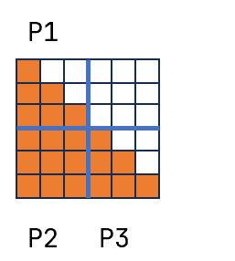
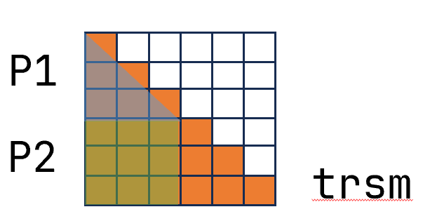
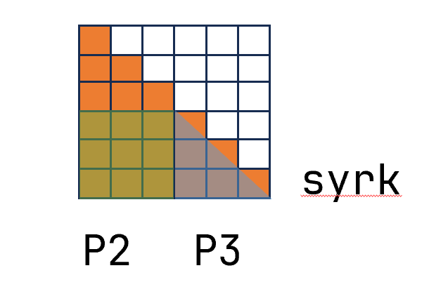
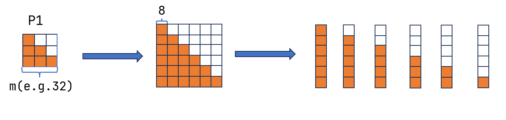
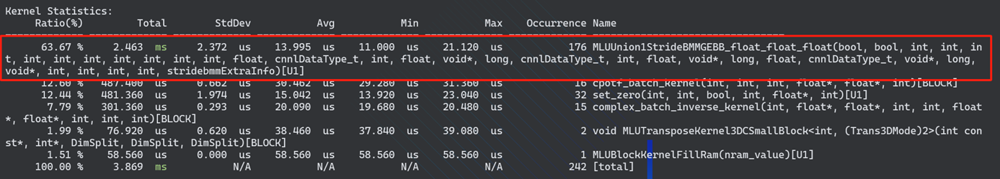
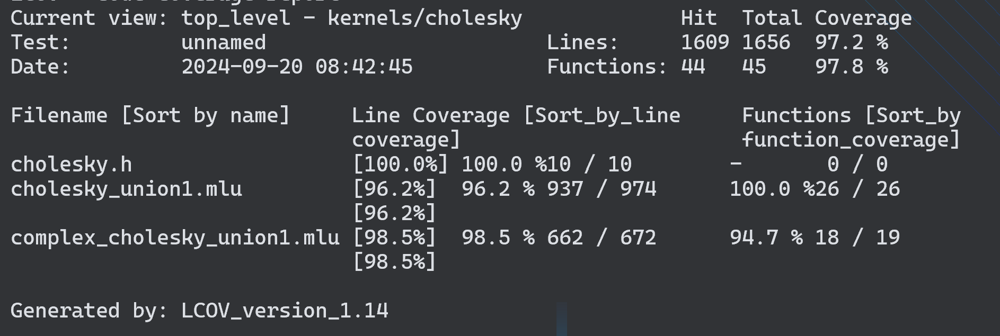

# MLU Cholesky 分解实现方案

- #### 文档基本信息

| 算子名称    | cholesky                |
| --------- | -------------------------------------|
| 编制人/日期 | 曹文轩/2024-07-21                      |

- #### 修改记录

| 版本号| 修订人 | 修订日期 | 修订描述 |
| ----- | ------ | -------  | -------  |
| V1.0  | 曹文轩    | 2024-07-21  | 首次提交 |

## 1 Cholesky分解算法介绍

Cholesky分解是科学和数值领域中最重要的算法之一。Cholesky算法是指将一个厄密特矩阵分解成一个下三角矩阵与其共轭转置之乘积，这种分解方式可以提高代数运算效率。

### 1.1 厄密特矩阵

厄密特矩阵，又称自伴随矩阵，是共轭对称的方阵。厄密特矩阵中对角线元素均为实数，且每个第i行j列的元素都与第j行i列的元素互为共轭转置。例如：
```math
\begin{bmatrix}
3 & 2+i  \\
2-i & 1 \\
\end{bmatrix}
```
对于一个矩阵$`A`$，如果其是厄密特矩阵，则可以对其进行Cholesky分解，如果其是正定矩阵（对于所有的非零实数$`x`$，都有$`x^TAx>0`$）则Cholesky分解的结果唯一，否则结果不唯一。

### 1.2 Cholesky分解

对正定厄密特矩阵$`A`$进行Cholesky分解，即求矩阵$`L`$使下式成立：
```math
A=LL^H
```
其中，$`L`$是一个下三角矩阵且对角元素均为正实数，$`L^H`$表示$`L`$的共轭转置，是一个上三角矩阵。当$`A`$是一个实数矩阵时，Cholesky分解可以改写为
```math
A=LL^T
```
下文中为表述方便，所有矩阵$`A`$均为实数矩阵。

对于一个$`n\times n`$的实矩阵$`A`$，Cholesky分解可以被写作如下过程：
```math
\begin{align*}
\begin{bmatrix}
a_{11} & a_{12} & a_{13} & a_{14} \\
a_{21} & a_{22} & a_{23} & a_{24} \\
a_{31} & a_{32} & a_{33} & a_{34} \\
a_{41} & a_{42} & a_{43} & a_{44} \\
\end{bmatrix}
&=
\begin{bmatrix}
l_{11} & 0 & 0 & 0 \\
l_{21} & l_{22} & 0 & 0 \\
l_{31} & l_{32} & l_{33} & 0 \\
l_{41} & l_{42} & l_{43} & l_{44} \\
\end{bmatrix}
\begin{bmatrix}
l_{11} & l_{21} & l_{31} & l_{41} \\
0 & l_{22} & l_{32} & l_{42} \\
0 & 0 & l_{33} & l_{43} \\
0 & 0 & 0 & l_{44} \\
\end{bmatrix} \\
&=
\begin{bmatrix}
l_{11}^2 & l_{11}l_{21} & l_{11}l_{31} & l_{11}l_{41} \\
l_{11}l_{21} & l_{21}^2 + l_{22}^2 & l_{21}l_{31} + l_{22}l_{32} & l_{21}l_{41} + l_{22}l_{42} \\
l_{11}l_{31} & l_{21}l_{31} + l_{22}l_{32} & l_{31}^2 + l_{32}^2 + l_{33}^2 & l_{31}l_{41} + l_{32}l_{42} + l_{33}l_{43} \\
l_{11}l_{41} & l_{21}l_{41} + l_{22}l_{42} & l_{31}l_{41} + l_{32}l_{42} + l_{33}l_{43} & l_{41}^2 + l_{42}^2 + l_{43}^2 + l_{44}^2 \\
\end{bmatrix}
\end{align*}
```

根据上式不难看出，每个$`a_{i,j}`$等于由$`l_{i,j}`$和$`L`$矩阵的其它元素组成的多项式，例如$`a_{32}=l_{21}l_{31}+l_{32}l_{22}`$，并且多项式中只有一个项包含了$`l_{i,j}`$（$`a_{32}`$等价的多项式中只有$`l_{22}l_{32}`$这一项），包含了$`l_{i,j}`$的项另一个因子都为对角线元素，因此为了计算$`l_{i,j}`$，可以由$`a_{i,j}`$减去不包含$`l_{i,j}`$的其它项然后除以对角线元素，这样就能算出每个$`l_{i,j}`$。

## 2 需求分析

### 2.1 算子需求分析

|                         算子功能简介                         | 对厄密特矩阵进行Cholesky分解 |
| :----------------------------------------------------------: | :--------------------------: |
|                           需求来源                           |           pytorch            |
|                           应用网络                           |              -               |
|                         输入数据类型                         |     float/complex float      |
|                          输入Shape                           |         [batch,N,N]/[N,N]          |
|                          输入Layout                          |      input/output:ARRAY      |
|                         输出数据类型                         |     float/complex float      |
|                          输出Shape                           |         [batch,N,N]/[N,N]        |
|                          输出Layout                          |            ARRAY             |
|                             模式                             |              无              |
| 是否含有 dim/axis 等类似语义的参数且该参数支持负数/其他特殊处理 |              无              |
| 是否含有 labels/index 等类似语义的参数且该参数支持负数/界外情况/其他特殊处理 |              无              |
|                       是否需要支持原位                       |              是              |
|                    是否需要支持stride机制                    |              否              |
|                       是否需要支持广播                       |              否              |
|                    0元素检查是否直接返回                     |              无              |
|                         其他特殊需求                         |              无              |
|                 本次开发优先支持的规模/模式                  |      batch<=32，N<=3000      |

### 2.2 算子功能和应用场景描述

厄密特矩阵，又称自伴随矩阵，是共轭对称的方阵。

对正定厄密特矩阵$`A`$进行Cholesky分解，即求矩阵$`L`$使下式成立：
```math
A=LL^*
```
其中，$`L`$是一个下三角矩阵且对角元素均为正实数，$`L^*`$表示$`L`$的共轭转置，是一个上三角矩阵。当$`A`$是一个实数矩阵时，Cholesky分解可以改写为
```math
A=LL^T
```

### 2.3 算子输入输出参数要求

|    参数     |      语义      | 类型 |       支持类型       |  物理布局   |     规模限制      |
| :---------: | :------------: | :--: | :------------------: | :---------: | :---------------: |
|   handle    |                | 句柄 |                      |      /      |        无         |
| input_desc  |   矩阵描述符   | 输入 |float、complex float                      |             |                   |
|   input   |    输入矩阵    | 输入 |  | [batch,N,N]/[N,N] | 所占空间不超过7GB |
| output_desc | 输出矩阵描述符 | 输入 | float、complex float |             |                   |
|  output   |    输出矩阵    | 输出 |                      | [batch,N,N]/[N,N]|     所占空间不超过7GB              |
|    upper    | 上三角/下三角  | 输入 |         bool         |             |                   |
|    workspace    | 用于矩阵分解的额外空间  | 输入 |         void*       |             |                   |

### 2.4 算子限制

| 限制类型    | 详细说明                                            |
| -----------| ------------------------------------------------------------ |
| 数据类型限制 | 输入输出矩阵的类型必须是float32或者complex类型                       |
| 布局限制    | 输入输出矩阵均为array |
| 规模限制    | batch <= 32, N<= 3000          |
| 功能限制    | 无                         |
| 数据范围限制 | 张量的最后两个维度数目需相同，upper为bool类型变量|
| 原位限制    | 仅支持原位        |
| stride限制 | 不支持stride机制  |
| 广播限制    | 不支持广播        |

### 2.5 验收标准

一方面输出结果的动态阈值 diff1， diff2， diff3_2 精度验收通过，另一方面使用输出结果 out 还原后的矩阵和原始输入矩阵 A 的动态阈值 diff1， diff2， diff3_2 精度验收通过，并且当 upper=False 时，out 为下三角矩阵；upper=True 时，out 为上三角矩阵。


## 3 Cholesky分解实现

### 3.1 计算流程
将输入矩阵进行分块，然后使用以下流程计算Cholesky分解：


图1 cholesky分解时间线

上图中，假设矩阵$`L`$的左边两列块已经计算完毕（黄色部分的非对角元和红色的对角元），这个流程展示了计算中间列块的过程（蓝色部分和橙色部分），完整的Cholesky计算只需要对分块后的所有列重复执行此流程。

SYRK(HERK)、GEMM和TRSM均为标准BLAS库中的操作，POTRF为计算对角块（完整矩阵的对角元素所在的块）内部依赖的kernel。下面将按照计算顺序依次介绍。

#### SYRK(HERK)

SYRK是BLAS的标准操作（数据类型是复数时为HERK），定义为：
```math
C=\alpha AA^T+\beta C
```
其中$`C`$为$`n\times n`$的方阵，$`A`$为$`n\times m`$的矩阵，$`\alpha`$和$`\beta`$是标量。

此处使用SYRK是为了计算橙色块的外部依赖，上式中的$`C`$代表橙色对角块（完整矩阵的对角元素所在的块），$`A`$代表橙色块左侧的所有黄色块，$`\alpha`$、$`\beta`$分别取-1和1。使用矩阵乘法算子可以实现此操作。


图2 syrk示意

#### GEMM

GEMM是BLAS的标准操作，定义为：
```math
C=\alpha AB+\beta C
```
其中$`C`$，$`A`$，$`B`$分别是$`m\times n`$，$`m\times k`$，$`k\times n`$的矩阵，$`\alpha`$和$`\beta`$是标量。

这里使用GEMM计算蓝色非对角块的外部依赖，上式的$`C`$代表蓝色块，$`A`$和$`B`$分别代表橙色块左侧的黄色块和蓝色块左侧的黄色块。$`\alpha`$和$`\beta`$分别为-1和1。和SYRK（HERK）相同，使用矩阵乘法算子可以实现此操作


图3 gemm示意

#### TRSM

TRSM是BLAS的标准函数，定义为：
```math
XA=\alpha B
```
已知下三角矩阵$`A`$和矩阵$`B`$，TRSM解出矩阵$`X`$，$`A`$为$`n\times n`$方阵，$`X`$和$`B`$为$`m\times n`$的矩阵。

对角块在SYRK后需要经过POTRF完成后续计算，这里假设已经计算完毕，于是可以通过TRSM完成蓝色块的剩余计算，TRSM执行后蓝色部分计算完毕。上式中$`A`$为红色块，$`X`$和$`B`$均为蓝色块，计算结果覆盖原矩阵。


图4 trsm示意
trsm的实现可以依靠对A矩阵求逆来完成。上式
```math
XA=\alpha B
```
可以变换成如下形式：
```math
X=\alpha BA^{-1}
```
因此可以将trsm转换计算矩阵A和计算矩阵乘法两个部分。计算矩阵A的逆矩阵时，由于A矩阵为三角阵，可以减少计算量。假设A为下三角阵，计算流程为：
* 计算对角元素:
```math
M_{ii} = \frac{1}{L_{ii}}
```
对于$`i = 1, 2, \ldots, n`$。

*  计算第$`i`$行其他元素，从第$`i`$列开始向左求解：
```math
M_{ij} = -\frac{1}{L_{ii}} \sum_{k=i+1}^{j} L_{ik} M_{kj}
```
上述计算过程利用矩阵的下三角结构大大简化了计算复杂度。

#### POTRF

POTRF这个函数名取自LAPACK中Cholesky分解的函数，POTRF的目的是计算橙色对角块的所有依赖，POTRF执行后对角块中的所有元素计算完毕。

对于POTRF计算的块边长的典型取值为512，这仍然是一个较大的规模，为了进一步分解，将其分成四个部分：


图5 potrf示意

由于输入矩阵是对角块，因此右上角部分忽略不计，剩下三个部分分别称作P1、P2、P3。

对于P1，它和POTRF的输入矩阵（完整的橙色矩阵）结构完全一致，因此直接递归调用POTRF进行计算，当P1的规模小于设定值时停止递归开始计算，后文详细介绍计算方法。

对于P2，使用TRSM即可完成对P2部分的计算，使用方式和上文相同。


图6 递归计算potrf中P1部分

对于P3，使用syrk可以完成P3外部依赖的计算，剩下的内部依赖继续调用POTRF即可完成计算。


递归计算potrf中P3部分

接下来介绍递归停止时计算POTRF的实现，此时输入矩阵的典型规模为32，将其分成若干8x8的小块，然后计算每个列块（由小块组成的列）


图7 最后一步划分

每个列块，仍然需要先计算该列块的外部依赖（该列块左侧的所有列块），然后对列块中的每一列分别计算内部依赖，对于这两个部分可以分别用两个kernel来实现。由于这一步骤是严重的串行瓶颈，因此在划分小块时需要尽量让计算的快更小，减少串行瓶颈对性能的影响

### 3.2 伪代码实现

整体计算流程伪代码如下：


```
function cholesky(row, nb, output):
    for j from 0 to row, incrementing by nb:
        jb = min(nb, row - j)

        // Perform symmetric rank-k update
        syrk(jb, j, OFFSET_ROW(output, j, 0), OFFSET_ROW(output, j, j))


        // Perform recursive Cholesky factorization
        potrf_rectile(jb, recnb, OFFSET_ROW(output, j, j))

        if j + jb < row:
            // Update matrix using matrix multiplication
            gemm(row - j - jb, jb, j, OFFSET_ROW(output, j + jb, 0), OFFSET_ROW(output, j, 0), OFFSET_ROW(output, j + jb, j))


        if j + jb < row:
            // Solve triangular system
            trsm(jb, row - j - jb, OFFSET_ROW(output, j, j), OFFSET_ROW(output, j + jb, j))
```

其中potrf_rectile伪代码如下：

```
function potrf_rectile(n, recnb, d_A):

    if n == 0:
        return SUCCESS

    if n <= recnb:
        potf2_lpin(n, d_A)
    else:
        n1 = n / 2
        n2 = n - n1

        potrf_rectile(n1, recnb, OFFSET_ROW(d_A, 0, 0))

        trsm_rectile(n1, n2, OFFSET_ROW(d_A, 0, 0), OFFSET_ROW(d_A, n1, 0))

        syrk(n2, n1, d_A + n1 * lda, OFFSET_ROW(d_A, n1, n1))

        potrf_rectile(n2, recnb, OFFSET_ROW(d_A, n1, n1))

    return SUCCESS


function potf2_lpin(n, dA):
    for i from 0 to n, incrementing by width:
        potf2_smlpout_device(m - i, OFFSET_ROW(dA, i), OFFSET_ROW(dA, i, i)) // call mlu kernel


function potf2_smlpout_device(m, A0, A):
    id = taskId % 4
    shared_data = allocate_shared_data()
    sdata_A = shared_data
    sdata_B = shared_data + m * POTFNB / TASKNUM * 4

    // Perform matrix multiplication with fixed width
    small_gemm(m, A0, sdata_A, sdata_B)

    sync_cluster()

    // Perform Cholesky factorization with fixed size
    spotf2_sminout_device(m, sdata_A, POTFNB)

    sync_cluster()

    span = POTFNB

    if id == 0:
        for i from 0 to span:
            copy_memory(A + (i * lda), sdata_A + i * POTFNB, i + 1, SRAM2LDRAM)
    else if id * span < m:
        copy_memory(A + (id * POTFNB * lda), sdata_A + id * POTFNB * POTFNB, POTFNB, SRAM2LDRAM, span - 1)

    sync_cluster()

```

trsm的实现伪代码如下：

```
function trsm(jb, row - j - jb, dA):
	inverse(dA)
	gemm
```

trsm调用的inverse内会使用inverse_kernel来对输入矩阵进行求逆：

```
function inverse_kernel(input, ld_input, stride_input, output, ld_output, stride_output, m):
    id = taskId
    if id == 0:
        copy_memory(sram_buffer, input, m)

    sync_cluster()

    span = m / taskDim
    start = id * span
    if id == 3:
        span = m - 3 * span

    nram_offset = allocate_nram_buffer(id, m)
    nram_src1 = nram_offset
    nram_src2 = nram_src1 + m * m
    mul_result = nram_src2 + m
    nram_dst = nram_src2 + m * m
    diag_start = calculate_diag_start(sram_buffer, start, m)
    height = m - start

    clear_memory(nram_offset, 3 * m * m)

    for i from 0 to span:
        offset = i * m + i
        result = inverse_element(diag_start[offset])
        nram_src1[i * height + i] = result
        nram_dst[i * span + i] = result
        diag_start[offset] = result

    sync_cluster()

    for i from 1 to height:
        copy_memory(nram_src2, diag_start + i * m, i)
        num = min(i, span)
        diag_element = diag_start[i * m + i]

        for j from 0 to num:
            temp = perform_element_multiplication_and_sum(mul_result, nram_src2, nram_src1 + j * height, i)
            temp = -1.0 * temp * diag_element
            nram_dst[i * span + j] = temp
            nram_src1[j * height + i] = temp

        sync()

    sync_cluster()

    if span > 0:
        copy_memory(diag_start, nram_dst, span, height)

    sync_cluster()

    if id == 0:
        copy_memory(output, sram_buffer, m, ld_output)

```


### 3.3 测试

#### 3.3.1 测试样例构造
测试用例覆盖多种类型。按照数据类型（float，complex float），矩阵维度（单batch、多batch），输出矩阵为上三角/下三角（即输入参数upper为True/False），是否将矩阵还原（是否将分解出的L和U矩阵相乘），可以得到16种类型，对每种类型分别测试，diff1，diff2，diff3_2结果均小于动态阈值。

#### 3.3.2 性能测试
float类型单batch性能测试如下，表格中数字为运行时间，单位为微秒（us），最右侧一列为mlu的运行时间与pytorch在gpu上的运行时间的比值：
upper为false：

| 规模 | pytorch | mlu   | mlu/pytorch |
| ---- | ------- | ----- | ----------- |
| 64   | 75.9    | 280   | 3.689065    |
| 256  | 161.5   | 1177  | 7.287926    |
| 1024 | 709     | 5576  | 7.864598    |
| 3000 | 3182    | 24220 | 7.611565    |
upper为true：

| 规模 | pytorch | mlu   | mlu/pytorch |
| ---- | ------- | ----- | ----------- |
| 64   | 80.9    | 321   | 3.967862    |
| 256  | 232.7   | 1554  | 6.678126    |
| 1024 | 988.7   | 7610  | 7.696976    |
| 3000 | 4173.9  | 31193 | 7.473346    |

float类型多batch性能测试：
upper为false：

| 规模    | pytorch | mlu    | mlu/pytorch |
| ------- | ------- | ------ | ----------- |
| 32,64   | 118     | 502    | 4.254237    |
| 16,512  | 1003    | 5405   | 5.388833    |
| 32,3000 | 97264   | 143560 | 1.475983    |

upper为true：

| 规模     | pytorch | mlu  | mlu/pytorch |
| -------- | ------- | ---- | ----------- |
| 32,64    | 113     | 582  | 5.150442    |
| 16, 512  | 1053    | 7041 | 6.68661     |
| 32, 3000 | 105062  | 207058  | 1.97082    |

float类型的cholesky分解在mlu端运行时间在pytorch运行时间的10倍以内。
complex类型单batch性能测试：

upper为false：

| 规模 | pytorch | mlu   | mlu/pytorch |
| ---- | ------- | ----- | ----------- |
| 16   | 56      | 68    | 1.214286    |
| 64   | 73      | 612   | 8.383562    |
| 128  | 110     | 1465  | 13.31818    |
| 3000 | 4826    | 76277 | 15.80543    |

upper为true：

| 规模 | pytorch | mlu   | mlu/pytorch |
| ---- | ------- | ----- | ----------- |
| 16   | 60      | 87    | 1.45        |
| 64   | 94      | 671   | 7.138298    |
| 128  | 162     | 1584  | 9.777778    |
| 3000 | 7124    | 81768 | 11.47782    |

complex类型多batch性能测试：

upper为false：

| 规模     | pytorch | mlu    | mlu/pytorch |
| -------- | ------- | ------ | ----------- |
| 32, 16   | 56      | 68     | 1.214286    |
| 32, 64   | 73      | 1510   | 20.68493    |
| 32, 128  | 218     | 3786   | 17.36697    |
| 4, 1024  | 2698    | 24535  | 9.093773    |
| 32, 3000 | 132817  | 922743 | 6.947477    |

upper为true：

| 规模     | pytorch | mlu   | mlu/pytorch |
| -------- | ------- | ----- | ----------- |
| 32, 16   | 63      | 166   | 2.634921    |
| 32, 64   | 119     | 1534  | 12.89076    |
| 32, 128  | 212     | 4700  | 22.16981    |
| 4, 1024  | 3183    | 26718 | 8.393968    |
| 32, 3000 | 142568  | 714415 | 5.01105      |

对于mlu/pytorch>10的规模，例如batch为32，N为128时，使用cnperf-cli进行性能分析，如下图所示


图中红框中为调用底层的矩阵乘法，且由于没有复数类型矩阵乘法的底层实现，当前复数矩阵乘是由4个float类型矩阵乘拼接而成。可以看到矩阵乘法的时间占比总和已经达到了60%，矩阵乘法所占用时间超过了2000微秒，已经超过了pytorch运行时间的10倍。

#### 3.3.3 新特性测试

- [✓] 数据类型测试：完成float和complex float类型测试
- [✓] 多维张量测试：完成二维和三维张量测试，其它维度会在算子入口报错
- [✓] Layout 测试：完成测试多种layout，
- [✓] 不同规模 / 整数余数端段 / 对齐不对齐测试：完成不同规模，不同形状输入测试
- [✓] 零维张量测试/ 0 元素测试：完成测试，0元素会在运行中报错
- [✓] 稳定性测试
- [ ] 多平台测试
- [✓] gen_case模块测试
- [✓] nan / inf测试：输入中若有nan会在运行中报错，与Pytorch一致
- [✓] bug 修复测试
- [✓] 内存泄漏检查
- [✓] 代码覆盖率检查：代码覆盖率达到95%要求


### 3.4 防呆检查
算子中做了如下检查：
* 所有指针不为NULL
* 输入输出矩阵的维度为2或者3
* 输入输出矩阵维度数相等
* 输入输出矩阵的后两个维度数目相同
* 输入/输出矩阵所占空间不得超过7GB


## 4 算子接口设计

计算接口为：

```c++
mluOpCholesky(mluOpHandle_t handle, const mluOpTensorDescriptor_t input_desc,
              float* input, const mluOpTensorDescriptor_t output_desc,
              float* output, bool upper, void* workspace)
```

获取额外空间大小接口为：

```c++
mluOpStatus_t MLUOP_WIN_API
mluOpGetCholeskyWorkspaceSize(mluOpTensorDescriptor_t input_desc, size_t *size);

```

变量含义为上文所述。

## 5 总结

本文介绍了在MLU上实现Cholesky分解的方案和需求分析。Cholesky分解是一种分解正定厄密特矩阵为下三角矩阵及其共轭转置的算法，广泛应用于科学和数值计算。本文首先解释了厄密特矩阵和Cholesky分解的基本原理，随后通过将输入矩阵分块，并利用BLAS标准操作中的的SYRK、GEMM和TRSM函数，以及自定义POTRF函数，展示了如何逐步实现分解。然后本文详细描述了算子的需求，包括支持的数据类型、形状、布局，以及特定的计算需求，如原位操作和步长机制，并提供了算子的接口设计。