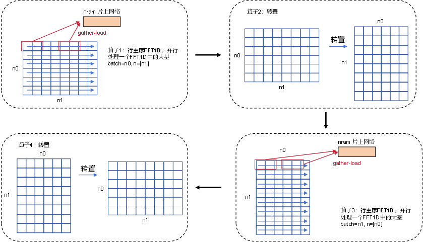
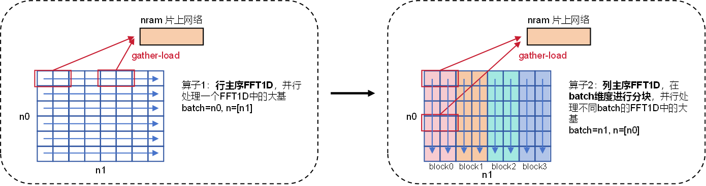

# FFT 算子开发设计方案


* #### 文档基本信息
| 算子名称                                   |
| ------------------------------------------ | 
| FFT(RFFT, IRFFT, FFT, IFFT)   | 

* #### 修改记录

| 版本号 | 修订人 | 修订日期   | 修订描述 |
| ------ | ------ | ---------- | -------- |
| V1.0   | 张儒戈 | 2024-07-01 | 首次提交 |

* #### 内容描述

本文档为`FFT`算子的设计文档，包括需求分析、接口设计、方案设计、性能优化记录和方案实施部分。

* #### 算子需求checklist

算子需求提出者需要`提供`的信息如下：

- 算子接口描述：实现RFFT, IRFFT, FFT, IFFT的1d和2dDFT算法
- 功能描述：实现RFFT, IRFFT, FFT, IFFT的1d和2d傅里叶变换算法
- 是否需要支持原位：需要
- 是否需要支持stride机制：需要

*当支持原位的时候，需要保证input的sequence长度补齐到output的sequence的长度，否则会出现未定义的结果。

算子需求提出者需要`check`的部分如下：

- 1.1 算子需求分析
- 1.2 算子功能和应用场景描述
- 1.3 算子输入输出参数要求
- 1.4 算子限制
- 1.5 验收标准
- 2.2 接口设计
- 3.5 测试用例（需求提出者check算子需求表中所给规模是否列出）

## 1 需求分析

### 1.1 算子需求分析

| 算子功能简介| 一种基于stock-ham快速傅里叶变换算法的优化            |
|-------------|--------------------------------------------------------------|
| 需求来源    | PyTorch/Tensorflow                                       |
| 应用网络    | Conformer                                        |
| 输入数据类型| half, float, complex_half, complex_float          |
| 输入Shape   | [batches, n0, n1] |
| 输入Layout  | ARRAY                             |
| 输出数据类型| half, float, complex_half, complex_float                         |
| 输出Shape   | [batches, n0, n1]                   |
| 输出Layout  | ARRAY                                                    |
| 模式(可选） |                                                              |
| 是否含有dim/axis等类似语义的参数且该参数支持负数/其他特殊处理 | 通过stride语义来支持dim |
| 是否含有labels/index等类似语义的参数且该参数支持负数/界外情况/其他特殊处理 | 无 |
| 是否需要支持原位        | 是                                                  |
| 是否需要支持stride机制  | 是                                                  |
| 是否需要支持广播  | 否                       |
| 0元素检查是否直接返回  | 否(array=0时不支持，支持以下两种情况：1.batch等于0；2.输入或者输出的dim等于0，但是补齐到array)                               |
| 其他特殊需求(在线量化，融合，转数提前等，可选)| 无 |
| 本次开发优先支持的规模/模式| 支持rfft,irfft,fft,ifft |

### 1.2 算子功能和应用场景描述

RFFT1D: 对一个 $n$ 的实数矩阵进行二维傅里叶变换，输出一个 $n/2+1$ 的复数矩阵。由于输入矩阵是实数序列，其傅里叶变换结果具有共轭对称性，因此仅输出前半部分结果。

IRFFT1D: RFFT的反向，对一个 $n/2+1$ 的复数矩阵进行二维逆傅里叶变换，输出一个 $n$ 的实数序列。由于输入矩阵是实数序列傅里叶变换结果的一部分，需利用共轭对称性自行补齐后半部分输入，再进行逆变换得到实数序列。

FFT1D: 对一个 $n$ 的复数矩阵进行二维傅里叶变换，输出一个同样大小的 $n$ 的复数序列。该算子对每一维度分别进行一维傅里叶变换，得到完整的频域表示。

RFFT2D: 对一个 $n_0 \times n_1$ 的实数矩阵进行二维傅里叶变换，输出一个 $n_0 \times ( n_1 /2+1)$ 的复数矩阵。由于输入矩阵是实数矩阵，其傅里叶变换结果具有共轭对称性，因此仅输出前半部分结果。

IRFFT2D: RFFT的反向，对一个 $n_0 \times ( n_1 /2+1)$ 的复数矩阵进行二维逆傅里叶变换，输出一个 $n_0 \times n_1$ 的实数矩阵。由于输入矩阵是实数矩阵傅里叶变换结果的一部分，需利用共轭对称性自行补齐后半部分输入，再进行逆变换得到实数矩阵。

FFT2D: 对一个 $n_0 \times n_1$ 的复数矩阵进行二维傅里叶变换，输出一个同样大小的 $n_0 \times n_1$ 的复数矩阵。该算子对每一维度分别进行一维傅里叶变换，得到完整的频域表示。

IFFT2D: FFT2D的反向，对一个 $n_0 \times n_1$ 的复数矩阵进行二维逆傅里叶变换，输出一个同样大小的 $n_0 \times n_1$ 的复数矩阵。该算子对每一维度分别进行一维逆傅里叶变换，将频域表示还原为时域表示。

公式1：

$$
Y_{k}=\sum_{n=0}^{N-1} w_{N}^{k \cdot n_2} \cdot x_{n}, k=0, \ldots, N-1
$$

一维FFT是针对输入规模为n的序列将其递归分解成若干较小规模的DFT，降低其计算复杂度,然后再对其做离散傅里叶变换。


公式2：
<!-- ```math
X[k]=\Sigma_n W_N^{kn}x(k)   \\

W_N^{kn}=e^{sign*ikn\frac{2\pi}{N}},
sign= \left \{
\begin{array}{ll}
-1, fft\  or \ rfft \\
1, ifft\  or \ irfft
\end{array}
\right.
``` -->

$$
Y_{k_1, k_2}=\sum_{n_1=0}^{N_1-1} w_{N_1}^{k_1 \cdot n_1} \cdot \left(\sum_{n_2=0}^{N_2-1} w_{N_2}^{k_2 \cdot n_2} \cdot x_{n_1, n_2}\right), k_l=0, \ldots, N_l-1
$$

可以将二维FFT看作是在输入的两个维度分别做一维FFT，因此其计算方式与一维FFT本质相同，这里不再对FFT计算细节进行赘述。

备注：

需要说明对nan/inf的特殊处理，输入存在nan/inf时，输出为按照IEEE754标准根据FFT计算公式得到，其中任何数乘nan为nan，0乘inf为nan，非0乘正负inf根据符号为正负inf，任何数加nan为nan，任何非nan数加正负inf根据符号为正负inf。
在部分情况下，pytorch的CPU结果和GPU结果并不是严格按照IEEE754标准和FFT计算公式得到，因此无法与MLU计算结果对齐。例如，某个batch的输入数据包含一个inf，且inf所在位置对应的系数不为0，此时GPU计算结果全为nan，但是MLU计算结果全为inf。
再例如，某个batch的输入部分包含一个nan，且nan所在位置对应的系数为0，此时GPU计算结果为0，但是MLU计算结果仍为nan。


### 1.3 算子输入输出参数要求

| 参数        | 语义 | 类型（输入/输出） | 支持类型    | 物理布局 | 规模限制         |
| ----------- | ---- | ----------------- | ----------- | -------- | ---------------- |
| handle      |MLU-OPS句柄，保存运行上下文信息      | 输入              |     mluOpHandle_t   | /        | 无               |
| fft_plan |执行计划参数的信息描述      | 输入              |      mluOpFFTPlan_t       | /        | 暂时不支持大质数 |
| input      |指向输入数据地址的指针      | 输入              | half, float， complex_half, complex_float | ARRAY    | 无               |
| scale_factor      |   比例因子，用于放大缩小一定比例   | 输入             | unsigned int | /    | 无               |
| workspace      |输入workspace数据的mlu地址指针      | 输入             | half, float | /    | 无               |
| output      |指向输出数据地址的指针      | 输出             | half, float， complex_half, complex_float | ARRAY    | 无               |
| direction      |   FFT正逆方向   | 输入             | FORWARD/BACKWARD | /    | 无               |

### 1.4 算子限制

| 限制类型     | 详细说明                                                     |
| ------------ | ------------------------------------------------------------ |
| 布局限制     | ARRAY                                                        |
| 数据范围限制 | 输入规模n只支持能够由2~64组成的公倍数，包含了大于64的素数则不行 |
| 广播限制     | 不支持广播                                                   |
| shape 限制   | 输入向量的shape保持一致  

### 1.5 验收标准

精度验收标准：支持规模范围内达到：动态阈值diff1, diff2精度验收通过。

性能验收标准：典型规模下达到：良好：算子hw time是竞品v100的5倍。 及格：算子hw time是竞品 v100的10倍

## 2 算子接口设计

### 2.1 参考接口

- TensorFlow

```python
# Computes the discrete Fourier transform over the dimensions of input.
tensorflow.signal.rfft(input_tensor, fft_length=None, name=None)

tensorflow.signal.irfft(input_tensor, fft_length=None, name=None)

tensorflow.signal.fft(input_tensor, name=None)

tensorflow.signal.ifft(input_tensor, name=None)

tensorflow.signal.rfft2d(input_tensor, fft_length=None, name=None)

tensorflow.signal.irfft2d(input_tensor, fft_length=None, name=None)

tensorflow.signal.fft2d(input_tensor, name=None)

tensorflow.signal.ifft2d(input_tensor, name=None)
```

- PyTorch
```python
# The Fourier domain representation of any real signal satisfies the Hermitian property: X[i, j] = conj(X[-i, -j]). This function always returns all positive and negative frequency terms even though, for real inputs, half of these values are redundant. rfft2() returns the more compact one-sided representation where only the positive frequencies of the last dimension are returned.
torch.fft.rfftn(input, s=None, dim=None, norm=None, *, out=None)->Tensor

torch.fft.irfftn(input, s=None, dim=None, norm=None, *, out=None)->Tensor

torch.fft.fftn(input, s=None, dim=None, norm=None, *, out=None)->Tensor

torch.fft.ifftn(input, s=None, dim=None, norm=None, *, out=None)->Tensor

torch.fft.fft2(input, s=None, dim=(-2, -1), norm=None, *, out=None) → Tensor

torch.fft.ifft2(input, s=None, dim=(-2, -1), norm=None, *, out=None) → Tensor

torch.fft.rfft2(input, s=None, dim=(-2, -1), norm=None, *, out=None) → Tensor

torch.fft.irfft2(input, s=None, dim=(-2, -1), norm=None, *, out=None) → Tensor
```

<!-- - Mathematica

```mathematica
Fourier[list]
(*finds the discrete Fourier transform of a list of complex numbers*)
Fourier[list, {p1, p2, ...}]
(*returns the specified positions of the discrete Fourier transform*)
``` -->

- Matlab

```matlab
# computes the discrete Fourier transform of X using a fast Fourier transform algorithm
# if X is a vector, then fft(X) returns the Fourier transform of the vector
Y = fft(X)
# returns the n-point DFT. If no value is specified, Y is the same size as X.
# If X is a vector, and the length of X is greater than n, then X is truncated to length n.
Y = fft(X, n)
# returns the Fourier transform along the dimension dim. For example, if X is a matrix, then fft(X, n, 2) returns the n-point Fourier transform of each row
Y = fft(X, n, dim)

% Y = fft2(X) returns the two-dimensional Fourier transform of a matrix X using a fast Fourier transform algorithm, which is equivalent to computing fft(fft(X).').'.

% When X is a multidimensional array, fft2 computes the 2-D Fourier transform on the first two dimensions of each subarray of X that can be treated as a 2-D matrix for dimensions higher than 2. For example, if X is an m-by-n-by-1-by-2 array, then Y(:,:,1,1) = fft2(X(:,:,1,1)) and Y(:,:,1,2) = fft2(X(:,:,1,2)). The output Y is the same size as X.

Y = fft2(X)

% Y = fft2(X,m,n) truncates X or pads X with trailing zeros to form an m-by-n matrix before computing the transform. If X is a matrix, then Y is an m-by-n matrix. If X is a multidimensional array, then fft2 shapes the first two dimensions of X according to m and n.

Y = fft2(X,m,n)
```

<!-- - OTFFT -->

<!-- ```c
OTFFT::RFFT::fwd(const_double_vector x, complex_vector y);
``` -->

- FFTW

```c
fftw_plan fftw_plan_dft_r2c_1d(int n0, double *in, fftw_complex *out, unsigned flags);

fftw_plan fftw_plan_many_dft_r2c(int rank, const int *n, int howmany, double *in, const int *inembed, int istride, int idist, fftw_complex *out, const int *onembed, int ostride, int odist, unsigned flags);


fftw_plan fftw_plan_dft_2d(int n0, int n1,
                           fftw_complex *in, fftw_complex *out,
                           int sign, unsigned flags);

fftw_plan fftw_plan_dft_r2c_2d(int n0, int n1,
                               double *in, fftw_complex *out,
                               unsigned flags);
void fftw_execute_dft(const fftw_plan p, 
                      fftw_complex *in, 
                      fftw_complex *out);

void fftw_execute_dft_r2c(const fftw_plan p,
                          double *in, 
                          fftw_complex *out);
void fftw_destroy_plan(fftw_plan plan);
```


### 2.2 接口设计

```c++
/*! The descriptor of FFT (Fast Fourier Transform) operator that holds FFT information including
 * the tensor descriptor of input tensor and output tensor, the rank of FFT, the FFT size on each
 * dimension, the size of reserved space and the size of workspace.
 *
 * You need to call the ::mluOpCreateFFTPlan function to create a descriptor for the FFT operator, and call
 * the ::mluOpMakeFFTPlanMany function to set the information of the FFT operator to the descriptor.
 * Then, you need to allocate the reserved space and set the space to the fft descriptor by ::mluOpSetReserveArea.
 * Also, you need to destroy the MluOp context at the end with the ::mluOpDestroyFFTPlan.
 */
typedef struct mluOpFFTStruct *mluOpFFTPlan_t;

/*!
 *  @brief Creates a descriptor pointed by \b fft_plan for the FFT operator, and allocates memory
 *  for holding the information about the FFT operation. The information is defined in ::mluOpFFTPlan_t.
 */
mluOpStatus_t mluOpCreateFFTPlan(mluOpFFTPlan_t *fft_plan);

/*!
 *  @brief Initializes the FFT descriptor pointed by \b fft_plan that is previously created
 *  with the ::mluOpCreateFFTPlan function, and sets the information about the
 *  tensor descriptors of input tensor and output tensor, the rank of FFT, and the FFT size on each
 *  dimension.
 *
 *  This function also gets the size of MLU memory buffers for FFT execution, including \b reservespace_size and
 *  \b workspace_size. The size of extra workspace is based on the given information of the
 *  \b fft_plan.
 */
mluOpStatus_t mluOpMakeFFTPlanMany(mluOpHandle_t handle,
                                   mluOpFFTPlan_t fft_plan,
                                   const mluOpTensorDescriptor_t input_desc,
                                   const mluOpTensorDescriptor_t output_desc,
                                   const int rank,
                                   const int n[],
                                   size_t *reservespace_size,
                                   size_t *workspace_size);
/*!
 *  @brief Bond the reserve space to the \b fft_plan. The size of reserved space can be derived through ::mluOpMakeFFTPlanMany.
 */
mluOpStatus_t mluOpSetFFTReserveArea(mluOpHandle_t handle,
                                     mluOpFFTPlan_t fft_plan,
                                     void *reservespace);
/*!
 *  @brief Executes any FFT. In case of complex-to-real and real-to-complex
 *  transforms \b direction parameter is ignored. This function stores the Fourier coefficients
 *  in the output array. If the address of input and output are the same, an in-place FFT
 *  is adopted.
 */
mluOpStatus_t mluOpExecFFT(mluOpHandle_t handle,
                           const mluOpFFTPlan_t fft_plan,
                           const void *input,
                           const float scale_factor,
                           void *workspace,
                           void *output,
                           int direction);

/*!
 *  @brief Destroys a FFT plan \b fft_plan that is created with the
 *  ::mluOpCreateFFTPlan function.
 */
mluOpStatus_t mluOpDestroyFFTPlan(mluOpFFTPlan_t fft_plan);
```

框架使用场景，下面假设一个二维fft，batch为2，n=[2048, 6000]的fft：

1. 建立fft描述符

   ```c
   mluOpFFTPlan_t fft_plan;
   mluOpCreateFFTPlan(&fft_plan);
   ```

2. 给fft描述符设定参数，并获取reserve_size，workspace_size大小

   ```c
   mluOpTensorDescriptor_t input_desc, output_desc;
   mluOpDataType_t input_data_type = MLUOP_DTYPE_FLOAT;
   mluOpDataType_t output_data_type = MLUOP_DTYPE_COMPLEX_FLOAT;
   mluOpDataType_t execution_dtype = MLUOP_DTYPE_FLOAT;
   const int rank = 2;
   const int batch = 2;
   const int n[rank] = {400};
   const int ndim = rank + 1;
   const int input_dim_size[ndim] = {batch, n[0], n[1]};
   const int input_dim_stride[ndim] = {n[0] * n[1], n[1], 1};

   const int input_dim_size[ndim] = {batch, n[0], n[1]};
   const int input_dim_stride[ndim] = {n[0] * n[1], n[1], 1};

   mluOpCreateTensorDescriptor(&input_desc);
   mluOpCreateTensorDescriptor(&output_desc);
   mluOpSetTensorDescriptorEx(input_desc, MLUOP_LAYOUT_ARRAY, input_data_type, ndim, input_dim_size, input_dim_stride);
   mluOpSetTensorDescriptorOnchipDataType(execution_dtype);
   mluOpSetTensorDescriptorEx(output_desc, MLUOP_LAYOUT_ARRAY, output_data_type, ndim,
                             output_dim_size, output_dim_stride);
   size_t reservespace_size;
   size_t workspace_size;
   mluOpMakeFFTPlanMany(handle, fft_plan, input_desc, output_desc, rank, n, &reservespace_size, &workspace_size);
   mluOpDestroyTensorDescriptor(input_desc);
   mluOpDestroyTensorDescriptor(output_desc);
   ```

3. 给plan绑定reservespace指针

   ```c
   void *reservespace;
   cnrtMalloc(&reservespace, reservespace_size);
   mluOpSetReserveArea(handle, fft_plan, reservespace);
   ```

4. 执行FFT，plan创建好以后可以执行多次

   ```c
   void *workspace;
   cnrtMalloc(&workspace, workspace_size);
   const float scale = 1.0;
   mluOpStatus_t mluOpExecFFT(handle, fft_plan, input, scale, workspace, output, 0);
   cnrtFree(workspace);
   ```

5. 算子运行完以后释放plan，释放reservespace。

   ```c
   mluOpDestroyFFTPlan(fft_plan);
   cnrtFree(reservespace);
   ```

## 3 实现方案设计

### 3.1 实现方案

#### 3.1.1 1d实现

为了跟适应MLU的硬件环境，本文对此进行了方案的适配设计。主要分为了以下两个方面。

##### 3.1.1.1 蝶形的分解和网络的选择
在host端，先针对输入的规模进行分解. 对于一个大规模的基可做两个步骤的分解，第一步是针对片下蝶形网络调用的大基分解，第二步是为了进一步降低计算复杂度，针对片下蝶形网络调用的小基对大基进行了进一步分解。大基的大小受限于nram的容量，计算时需要全部加载到nram中。
最终形成的radix，本算法会优先采用64等较大规模的基，若不能被较大的基分解，会从64逐步减小，直至能够被分解为止。

由于stockHam蝶形网络适合任意混合基，且输入输出连续，不需要位元翻转，因此我们采用stockham作为我们的迭代FFT方案。

##### 3.1.1.2 蝶形计算
在蝶形计算的过程中，针对MLU的矩阵计算单元，本方案拟采用矩阵乘的方法进行蝶形计算。在执行计算前，会根据分解情况，对不同大小的基，生成dft_matrix,其存储了蝶形旋转因子矩阵的计算数据和矩阵大小。计算时，会提前将旋转因子矩阵从GDRAM中拷贝到NRAM.
计算时，同时取多个蝶形数据进行计算。

#### 3.1.2 2d实现

fft2d可以理解为先做一个bacth=n0, n=[n1]的行主序fft1d, 再做一个bacth=n1, n=[n0]的列主序fft1d。

##### 3.1.2.1 列主序fft1d实现
经过测试，如果采用拼接算子的方式来实现列主序fft1d的功能，即“转置+行主序ff1d+转置”,如下图所示，那么80%以上的开销都在于转置算子，因此需要额外实现列主序fft1d。


下图为"行主序+列主序"版本实现的流程。

在行主序fft1d中，我们通过同时访存同一个1d fft内不同蝶形并同时计算，从而提升访存（2d memcpy）和矩阵乘计算效率。

在列主序fft1d中，我们采用访存不同batch的1d fft内相同蝶形并同时计算，从而提升访存（2d memcpy）和矩阵乘计算效率。对于列主序fft1d中的2d memcpy，其stride约为fft1d的n1倍。对于行主序fft1d,我们总是希望尽可能将一个fft分解为足够大的蝶形并加载到nram上进行计算，从数学的角度而言，这样的方式能实现GDRAM和NRAM之间访存的最小化。但如果列主序fft1d也采用这样的策略，会使得2d memcpy的stride和segnum都很大，导致memcpy效率急剧下降。因此，我们只能选择一次并行去访存多个batch的较小蝶形，从而增大memcpy的size，降低segnum。

实现fft1d中蝶形分解策略的函数位于fft_plan中，我们举个例子看看列主序和行主序的不同，对于n0=2048的1d fft：1）对于行主序，2048可以完全被load到NRAM上，因此我们直接将fft分解为一个stage {2048}，直接将radix-2048的蝶形load到NRAM中，之后在NRAM上计算radix-2048时，我们再将其分解为3个stage的片上蝶形网络 {16-16-8}。 2）而对于列主序而言，为提升访存效率，我们将fft分解为{16-16-8}3stage的片下蝶形网络，分别将radix-16，16，8 蝶形load到NRAM上，对于radix-16而言，在片上网络可以继续分解为{4-2-2}3stage的片上网络，radix-8可以继续分解为{4-2}的2stage片上网络。

当前测试表明，列主序这样的分解以及对应的访存模式，可以大大减小stride过大带来的影响。


##### 3.1.3.2 行主序batch循环软流水实现

对于fft2d而言，其对行主序fft1d的调用往往会有较多batch。我们拟增加对于batch之间的软流水优化，从而提升性能。

### 3.2调用方案设计

目前实现的方案如下：

- 调用bacth=n0, n=[n1]的行主序fft1d
- 调用bacth=n1, n=[n0]的列主序fft1d

### 3.3 拆分(任务拆分，多核拆分)

1. 将行主序的fft1d的batch均分给不同的MLU core并行处理
2. 将列主序的fft1d的batch均分给不同的MLU core并行处理

### 3.4 方案理论性能

完成上述3.1，3.2，3.3几个步骤之后，基本可以给出一个理论性能，不需要每一个算子都有过于复杂的公式，但是一定要对自己的算子有一个心理的预期，最终实现之后的效率值是多少。

### 3.5 可维护性设计

1、bangc代码中加入必要的 log信息，比如输入的规模、数据类型、layout这些，以及如果出错会导致程序core dump的变量，比如IO指令的data_size、dim xyz的值等，这些信息都是有利于快速定位问题。

2、对每一个函数命名变量命名都有充分的注释

3、避免魔鬼数字，对于确定的数字尽量使用公共宏来替代   (待提供公共宏文档)

### 3.6 测试用例设计

- 框架在需求列表中给出的算子在网络中用到的规模：

#### 3.6.1 1d测试用例设计
- **input1**

  ```c
  dims: 32
  dims: 2048
  dim_stide: 2048
  dim_stride: 1
  ```

- **output1**

  ```c
  dims: 32
  dims: 2048
  dim_stide: 2048
  dim_stride: 1
  ```

- **input2**

  ```c
  dims: 32
  dims: 2048
  dim_stide: 2048
  dim_stride: 1
  ```

- **output2**

  ```c
  dims: 32
  dims: 1025
  dim_stide: 1025
  dim_stride: 1
  ```

- **input3**

  ```c
  dims: 32
  dims: 1025
  dim_stide: 1025
  dim_stride: 1
  ```

- **output3**

  ```c
  dims: 32
  dims: 2048
  dim_stide: 2048
  dim_stride: 1
  ```

#### 3.6.2 2d测试用例设计
- **input1**

  ```c
  dims: 768
  dims: 90
  dims: 180
  dim_stide: 1
  dim_stride: 138240
  dim_stride: 768 
  ```

- **output1**

  ```c
  dims: 768
  dims: 90
  dims: 91
  dim_stide: 1
  dim_stride: 69888
  dim_stride: 768
  ```

- **input2**

  ```c
  dims: 768
  dims: 90
  dims: 91
  dim_stide: 1
  dim_stride: 69888
  dim_stride: 768
  ```

- **output2**

  ```c
  dims: 768
  dims: 90
  dims: 180
  dim_stide: 1
  dim_stride: 138240
  dim_stride: 768 
  ```

- **input3**

  ```c
  dims: 1
  dims: 2048
  dims: 6000
  dim_stide: 12288000
  dim_stride: 6000
  dim_stride: 1
  ```

- **output3**

  ```c
  dims: 1
  dims: 2048
  dims: 6000
  dim_stide: 12288000
  dim_stride: 6000
  dim_stride: 1
  ```

其他可根据需要进行补充。

### 3.8 算子防呆检查


- 列出算子需要做的防呆，比如

 1、检查handle, plan, desc指针是否为空；

 2、检查rank 是否为 1， 2；

 3、输入输出维度防呆；

 4、输入输出数据类型防呆，针对r2c, c2r, c2c分别防呆；

 5、batch 大小防呆；

 6、execution dtype 数据类型防呆，200为INT31， 300为INT31或float。

 7、输入输出stride防呆；

 8、检查signal length是否如下，rfft：output = n / 2 + 1，irfft：output = n，fft： output = n；

 9、输入输出空指针防呆，如果输入元素不为0，防空指针；输出必不为空指针。

 9、 3-d fft，尚未支持。

## 4 算子性能/精度问题 & 优化记录

### 4.1 当前存在问题的规模说明

（暂无） 

### 4.2 已经过优化的规模说明

目前FFT1d和FFT2d其中一维所分解支持的规模为2~63中任意几组数的幂的组合，如：$2^x 3^y5^z...$，均能进行高效实现。除此外1d还支持$2^M*L$的规模。需要注意的是，在过程中，大基分解的精度不如小基分解的精度，但大基分解的速度快于小基分解的速度。如：4096规模，可以被分解成为64x64和16x16x16，64x64的分解方法相较于后一种速度较快。 目前在列主序实现中，2048规模将进行16x16x8的分解。其他规模可根据精度要求和速度要求进行选择。


