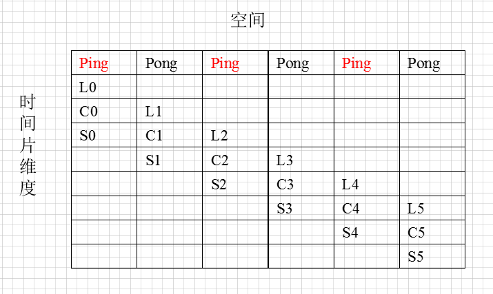
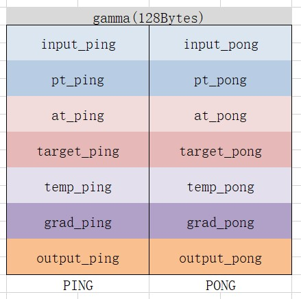

# FocalLossSigmoidBackward 算子开发设计方案

- #### 文档基本信息

| 算子名称    | FocalLossSigmoidBackward     |
| ----------- | ------------                |
| 编制人/日期 | 赖健东/2021-7-27                                             |

- #### 修改记录

| 版本号 | 修订人 | 修订日期   | 修订描述 |
| ----- | ----- | -------   | ------- |
| V1.0  | 赖健东 | 2021-7-27 | 首次提交 |

- #### 内容描述

本文档为`FocalLossSigmoidBackward`算子的设计文档，包括需求分析、接口设计、方案设计、性能优化记录。

- #### 算子需求 checklist

* 算子接口描述
* 功能描述
* 框架版本 + 对应源码路径
* 需求对应网络
* 网络中用到的规模
* 是否需要支持原位
* 是否需要支持 stride 机制
* 框架单元测试阈值指标（可选）

## 1 需求分析

### 1.1 算子需求分析

该需求分析为框架原生算子实现功能的需求分析，对于框架原生支持但 MLU-OPS 当前版本不支持的功能，需要在`1.4算子限制` 章节中显式注明。未明确注明不支持的功能，默认 MLU-OPS 全部支持。

example:

| 算子功能简介                                                 | focal_loss_sigmoid 算子反向                                  |
| ------------------------------------------------------------ | ------------------------------------------------------------ |
| 需求来源                                                     | PyTorch                                                      |
| 应用网络                                                     | mmdet-retinanet                                              |
| 输入数据类型                                                 | `input,weight,grad_output` 数据类型需一致，为 float/half；`target`数据类型为int32；`reduction`为枚举类 |
| 输入标量参数                                                 | `alpha`、`gamma`的数据类型均为float                          |
| 输入 Shape                                                   | `input`: [N, C]<br />`target`: [N]<br />`weight`: [C]<br /> `grad_output`: [N, C] |
| 输入 Layout                                                  | ARRAY                                                        |
| 输出数据类型                                                 | float/half                                                   |
| 输出 Shape                                                   | 输出shape 受 `reduction`模式影响，`reduction`模式为`None`时输出shape为[N, C] |
| 输出 Layout                                                  | ARRAY                                                        |
| 模式(可选）                                                  | `reduction`：暂不支持`None`以外模式                          |
| 是否含有 dim/axis 等类似语义的参数且该参数支持负数/其他特殊处理 | 无                                                           |
| 是否含有 labels/index 等类似语义的参数且该参数支持负数/界外情况/其他特殊处理 | 无                                                           |
| 是否需要支持原位                                             | 否                                                           |
| 是否需要支持 stride 机制                                     | 否                                                           |
| 是否需要支持广播                                             | 否                                                           |
| 0 元素检查是否直接返回                                       | 是                                                           |
| 其他特殊需求(在线量化，融合，转数提前等，可选)               | 无                                                           |
| 本次开发优先支持的规模/模式                                  | 无                                                           |

### 1.2 算子功能和应用场景描述

`FocalLoss` 是在标准`CrossEntropy` 的基础上修改得到的，其目的是通过减少易分类样本的加权系数，解决难易样本数量不平衡的问题，从而使得模型在训练时更专注于难分类的样本。本算子应用于基于mmdetection的RetinaNet网络。focalLossSigmoidBackward的功能是对focalLossSigmoidForward进行求导运算，给定输入数据（input）、对应标签值（target）、平衡因子（alpha)、调节因子（gamma)，加权系数数据（weight），通过focal loss反向公式运算，得到对输入数据的梯度值（grad_input)。

相关参考链接为：https://zhuanlan.zhihu.com/p/80594704

### 1.2.1 FL算法基本公式

(1) `FocalLoss` 正向计算公式为：

```math
p = Sigmoid(input)
```

```math
p_t =
\begin{cases}
p,   & target[n] = c \\
1-p, & otherwise
\end{cases}
```
```math
\alpha_t =
\begin{cases}
\alpha,   & target[n]=c \\
1-\alpha, & otherwise
\end{cases}
```
```math
FL(p_t) = -\alpha_t(1-p_t)^\gamma log(p_t)
```
```math
FL =
\begin{cases}
-\alpha(1-p)^\gamma log(p), & target[n]=c\\
-(1-\alpha)p^\gamma log(1-p), & otherwise
\end{cases}
```
```math
n = 0,1,2,3,...,N - 1
```
```math
c = 0,1,2,3,...,C-1
```

- `p` 为 `input` 通过`Sigmoid`计算所得的概率值
- `alpha` 表示平衡因子
- `gamma` 表示调节因子

（2) Focal Loss反向公式

对Focal Loss的正向公式进行求导，得到以下公式

```math
FL^{'} =
\begin{cases}
-\alpha*(1-p)^\gamma*(1-p-\gamma*p*log(p)) & target[n]=c \\
-(1-\alpha)*p^\gamma*(\gamma*(1-p)*log(1-p)-p) & otherwise
\end{cases}
```

如果存在weight输入，则需乘以weight，得到算子最终的输出grad_input

```math
gradInput = FL^{'} *weight* gradOutput =
\begin{cases}
-\alpha*(1-p)^\gamma*(1-p-\gamma*p*log(p))*weight[target[n]]*gradOuput & target[n]=c \\
-(1-\alpha)*p^\gamma*(\gamma*(1-p)*log(1-p)-p)*weight[target[n]] & otherwise
\end{cases}
```

### 1.3 算子输入输出参数要求

| 参数             | 语义                   | 类型（输入/输出） | 支持类型                          | 物理布局 | 规模限制                                |
| ---------------- | ---------------------- | ----------------- | --------------------------------- | -------- | -------------------------------------- |
| handle           | 操作句柄               | 输入              | mluOpHandle_t                      | /        | /                                       |
| prefer           | 运算模式               | 输入              | const mluOpComputationPreference_t | /        | /                                       |
| reduction        | 规约模式               | 输入              | const mluOpLossReduction_t         | /        | /                                       |
| input_desc       | 输入预测值张量描述符   | 输入                | const mluOpTensorDescriptor_t      | /        | /                                       |
| input            | 输入数据               | 输入              | float/half                        | ARRAY    | 二维数据，形状为[N,C]                   |
| target_desc      | 输入数据对应标签描述符 | 输入                | const mluOpTensorDescriptor_t      | /        | /                                       |
| target           | 输入数据对应标签       | 输入               | int32                             | ARRAY    | 一维数据，形状为[N]                     |
| weight_desc      | 加权系数张量描述符         | 输入              | const mluOpTensorDescriptor_t      | /        | /                                       |
| weight           | 加权系数数据               | 输入              | float                             | ARRAY    | 一维数据，形状为[C]                     |
| alpha            | 平衡因子               | 输入              | float                             | 标量     | 无                                      |
| gamma            | 调节因子               | 输入              | float                             | 标量     | 200系列板卡：[0, 8]<br>MLU370:[0, 1000] |
| grad_input_desc  | 输出张量描述符         | 输入              | const mluOpTensorDescriptor_t      | /        | /                                       |
| grad_input       | 输出数据               | 输出              | float                             | ARRAY    | 二维数据，形状为[N,C]                   |

### 1.4 算子限制

| 限制类型     | 详细说明                                                     |
| ------------ | ------------------------------------------------------------ |
| 数据类型限制 | 数据类型需与1.3小节匹配                                      |
| 布局限制     | 物理布局需与1.3小节匹配                                      |
| 规模限制     | 1.gamma暂不支持小于等于0的规模<br>2. 当weight为NULL时，target中元素的取值为[0，C]；当weight不为NULL时，target中元素的取值为[0，C-1]<br>3. 此版本优先支持多核之间C维度不拆的case。当weight为NULL时，在MLU200系列板卡中C的范围需在[0, 8154]， MLU370板卡中C的范围需在[0，13615]；当weight不为NULL时，在MLU200系列板卡中C的范围需在[0, 7520]， MLU370板卡中C的范围需在[0，12544]；<br>4. 由于硬件激活指令精度不足，在MLU200系列板块中，gamma的取值范围需在[0, 8]，在MLU370中，gamma的取值范围需在[0, 10000]<br>5. weight 暂不支持包含 inf 和 -inf 的输入 |
| 功能限制     | 1. reduction为预留参数，暂不支持None以外的情况<br>2.reduction为预留参数，暂不支持HIGH_PRECISION模式<br>3.此版本暂不支持输入数据为half类型 |

### 1.5 验收标准

#### 1.5.1 精度验收标准

- 精度验收标准：该算子为计算、激活类算子，采用当前的 diff1 diff2 评价公式，验收标准为 0.3%。

#### 1.5.2 性能验收标准

- 网络中使用到的规模性能不低于竞品
- 当前网络中的输入规模为`input.shape=[N, 80]`，`N`取值需包含2520、8892、34200、136800、547200、2772、9829、37800、151200、604800

## 2 算子接口设计

### 2.1 参考接口

- TensorFlow

```c++
tfa.losses.SigmoidFocalCrossEntropy(
    form_logits: bool = False,
    alpha: tfa.types.FloatTensorLike = 0.25,
    gamma: tfa.types.FloatTensorLike = 2.0,
    reduction: str = tf.keras.losses.Reduction.NONE,
    name: str = 'sigmoid_focal_crossentropy'
)
```

- PyTorch
```c++
// mmcv源码实现接口
void sigmoid_focal_loss_backward(Tensor input, Tensor target, Tensor weight, Tensor grad_input, float gamma, float alpha);

// 上层调用接口
def backward(ctx, grad_output):
    input, target, weight = txt.saved_tensors

    grad_input = input.new.zeros(input.size())

    ext_module.sigmoid_focal_loss_backward(
        input,
        target,
        weight,
        grad_input,
        gamma=ctx.gamma.
        alpha=ctx.alpha)

    gred_input *= gred_output;
    if ctx.reduction == ctx.reduction_dict['mean']:
        grad_intput /= input.size(0)
    return grad_input, None, None, None, None, None
```

上面的代码中，grad_output是我们输入的梯度值，grad_input是我们所有得到的output。从代码中可以看出，上层接口调用底层cuda接口时，提供了weight，但没有提供reduction和grad参数。在cuda层面的函数中，在运算的最后乘以weight后结束。上层在拿到output后，乘以输入的梯度，然后进行规约操作


### 2.2 接口设计

输入参数`reduction` 使用 `mlu_op.h`中定义的枚举类型`mluOpLossReduction_t`

```c++
typedef enum {
  MLUOP_LOSS_REDUCTION_NONE = 0,
  /*!< No reduction is applied in the operation.*/
  MLUOP_LOSS_REDUCTION_SUM = 1,
  /*!< The elements of output are summed in the operation.*/
  MLUOP_LOSS_REDUCTION_MEAN = 2,
  /*!< The weighted mean of the output is applied in the operation.*/
} mluOpLossReduction_t;
```

```c++
mluOpStatus_t MLUOP_WIN_API mluOpFocalLossSigmoidBackward(mluOpHandle_t handle,
                                                          const mluOpComputationPreference_t prefer
                                                          const mluOpLossReduction_t reduction,
                                                          const mluOpTensorDescriptor_t input_desc,
                                                          const void *input,
                                                          const mluOpTensorDescriptor_t target_desc,
                                                          const void *target,
                                                          const mluOpTensorDescriptor_t weight_desc,
                                                          const void *weight,
                                                          const float alpha,
                                                          const float gamma,
                                                          const mluOpTensorDescriptor_t grad_input_desc,
                                                          void *grad_input);
```

## 3 实现方案设计

### 3.1 实现方案

`mluOpFocalLossSigmoidBackward`的输入形状为 `[N, C]`，`target`的`shape`为`[N]`，`weight`的`shape`为`[C]`，`grad`的`shape`为`[N,C]`，计算概率：

```math
p = sigmoid(input)　　　　
```

`mluOpFocalLossSigmoidBackward`的计算公式为:

```math
FL^{'} =
\begin{cases}
-\alpha*(1-p)^\gamma*(1-p-\gamma*p*log(p)) & target[n]=c \\
-(1-\alpha)*p^\gamma*(\gamma*(1-p)*log(1-p)-p) & otherwise
\end{cases}
```
```math
n = 0,1,2,3,...,N - 1
```
```math
c = 0,1,2,3,...,C-1
```
```math
gradInput = FL^{'}*gradOutput
```

令中间值$`\alpha_t, p_t`$如下：

```math
pt_{n,c} =
\begin{cases}
p_{n,c} ,  & target[n]=c \\
1-p_{n,c} , & otherwise
\end{cases}
```
```math
\alpha t_{n,c} =
\begin{cases}
\alpha,  & target[n]=c \\
\alpha-1, & otherwise
\end{cases}
```
```math
n = 0,1,2,3,...,N-1
```
```math
c = 0,1,2,3,...,C-1
```

进行向量化后，`mluOpFocalLossSigmoidBackward`的计算公式可以表示为

```math
temp = FL^{'} = -\alpha t*(1-pt)^\gamma*(1-pt-\gamma*pt*log(pt))
       = -\alpha t* e^{\gamma*log(1-pt)} *(1-pt-\gamma*pt*log(pt))
```

如果存在weight，则需将以上结果乘以weight:

```math
gradInput = temp*weight[target[n]]
          = (-\alpha t* e^{\gamma*log(1-pt)} *(1-pt-\gamma*pt*log(pt)))*weight[target[n]]
```


- **具体的实现方案如下：**

target[n]的取值为[0，C]，在构造$`p_t`$和$`\alpha _t`$的过程中，考虑到target[n] =c时只有N个数，其余N*(C-1)个数为otherwise时的取值。因此先将$`p_t`$和$`\alpha _t`$的元素值都初始化为otherwise的值，再遍历N维度来设置target[n] =c时的取值。

```math
p = sigmoid(input)
```
```math
pt = 1-p
```
```math
\alpha t = nramSet(\alpha-1)
```

```cpp
for (int n = 0; n < N; n++) {
  int idx = n * C + target[n];
  *(pt + idx) = *(p + idx);
  *(alpha_t + idx) = alpha;
}
```

```math
temp  = -\alpha t* e^{\gamma*log(1-pt)}
```
```math
output = (1-pt-\gamma*pt*log(pt))
```
```math
output = output * temp
```
```math
output = output[n][c] * weight[target[n]]
```

### 3.2 伪代码实现

- 无

### 3.3 拆分(任务拆分，多核拆分)

- 实现的任务类型为U1任务，输入数据的shape为[N，C]，考虑到网络实际中C的取值较小，多核之间在N维度进行均等拆分。

### 3.4 性能优化设计

为了性能考虑，整个计算过程可以分为三级流水，即Gdram2Nram, Compute, Nram2Gdram。将NRAM上分配的空间分成两部分，一部分进行IO的同时，另一部分进行计算。相邻时间片之间使用sync隔开。

三级流水线的排流水过程如下所示：



NRAM的空间分配如下：



### 3.5 可维护性设计

相对独立的功能做成函数，减少耦合、增加代码可读性；关键变量及核心实现添加注释说明；

### 3.6 测试用例设计

- 输入数据`input` 的`shape`为 `[N, C]`， 测例中的N取值需包含2520、8892、34200、136800、547200、2772、9829、37800、151200、604800。
- 网络中参数`weight`恒为 `None`。
- 网络中参数`reduction`恒为 `MLUOP_LOSS_REDUCTION_NONE`。

其他可根据需要进行补充。算子开发完毕后，补充测试报告链接。

### 3.7 算子防呆检查

1、指针为空防呆；
2、0元素检查防呆，VLOG(5)打印信息，是否返回与框架沟通；
3、是否需要对输入输出支持的dtype、layout以及shape进行防呆；
4、算子存在的自身的相关参数防呆。
5、根据1.4节中的算子限制添加防呆

## 4 算子性能/精度问题 & 优化记录

### 4.1 当前存在问题的规模说明

- 首次提交，暂无

### 4.2 已经过优化的规模说明

- 首次提交，暂无
