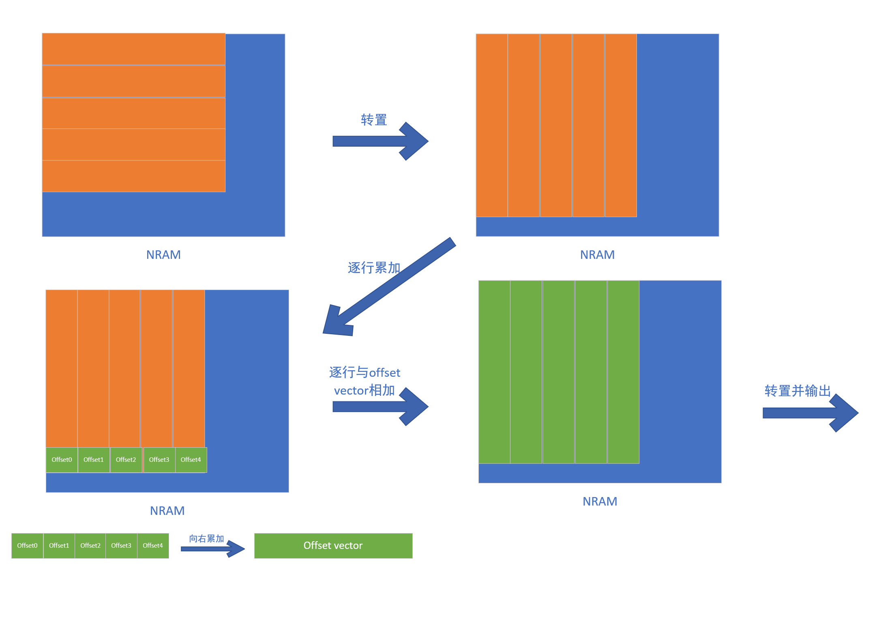
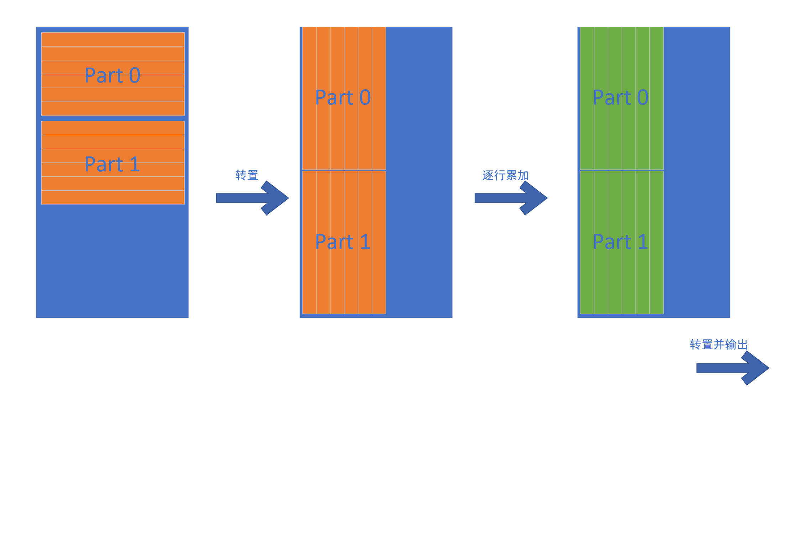
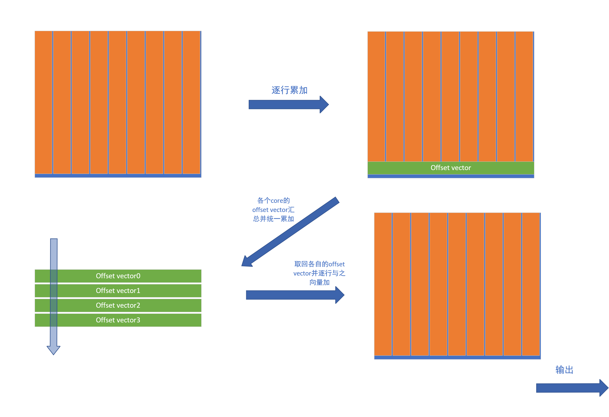

# logcumsumexp算子开发设计方案

* #### 文档基本信息

| 算子名称    | LOGCUMSUMEXP     |
| ----------- | ---------------- |
| 编制人/日期 | 徐小虎/2024-5-22 |

* #### 修改记录

| 版本号 | 修订人 | 修订日期  | 修订描述 |
| ------ | ------ | --------- | -------- |
| V1.0   | 徐小虎 | 2024-5-22 | 首次提交 |
| V1.1   | 徐小虎 | 2024-6-2  |          |

* #### 内容描述

本文档为`logcumsumexp`算子的设计文档，包括需求分析、接口设计、方案设计、性能优化记录。

* #### 算子需求checklist


算子需求提出者需要`check`的部分如下：

- 1.1 算子需求分析
- 1.2 算子功能和应用场景描述
- 1.3 算子输入输出参数要求
- 1.4 算子限制
- 1.5 验收标准
- 2.2 接口设计
- 3.5 测试用例（需求提出者`check`算子需求表中所给规模是否列出）

## 1 需求分析

### 1.1 算子需求分析

| 算子功能简介                                                 | 返回给定维度中输入张量每行的求和指数的对数 |
| ------------------------------------------------------------ | ------------------------------------------ |
| 需求来源                                                     | Pyrorch                                    |
| 应用网络                                                     | /                                          |
| 输入数据类型                                                 | input: half/float，dim: int32_t            |
| 输入Shape                                                    | input: 无要求                              |
| 输入Layout                                                   | input:  ARRAY                              |
| 输出数据类型                                                 | output: 与input保持一致                    |
| 输出Shape                                                    | output: 与input保持一致                    |
| 输出Layout                                                   | output: ARRAY                              |
| 模式(可选)                                                  | 无                                         |
| 是否含有dim/axis等类似语义的参数且该参数支持负数/其他特殊处理 | 否                                         |
| 是否含有labels/index等类似语义的参数且该参数支持负数/界外情况/其他特殊处理 | 否                                         |
| 是否需要支持原位                                             | 否                                         |
| 是否需要支持stride机制                                       | 否                                         |
| 是否需要支持广播                                             | 否                                         |
| 0元素检查是否直接返回                                        | 否                                         |
| 其他特殊需求(在线量化，融合，转数提前等，可选)               | 无                                         |
| 本次开发优先支持的规模/模式                                  | 无                                         |


### 1.2 算子功能和应用场景描述

`logcumsumexp` 算子根据给定的张量tensor和维度dim返回给定维度中输入张量每行的求和指数的对数，即
$$
logcumsumexp(x)_{ij}=log∑^i_{j=0}exp(x_{ij})
$$
`logcumsumexp`算子在神经网络中的应用主要集中在处理数值稳定性的问题，特别是在计算涉及对数空间的累积和时。比如，在处理概率分布时，尤其是当概率值非常小时，直接计算累积和可能会导致数值下溢。通过在对数空间进行累积和，可以避免这种问题。`logcumsumexp`算子可以在对数空间中进行累积和计算，从而确保数值稳定性。

该算子的应用例：

```python
>>>input=torch.tensor([[ 1.,  2.,  3.,  4.],
                       [ 5.,  6.,  7.,  8.]])
>>>output=torch.logcumsumexp(input,1)
>>>print(output)
tensor([[1.0000, 2.3133, 3.4076, 4.4402],
        [5.0000, 6.3133, 7.4076, 8.4402]])

```

### 1.3 算子输入输出参数要求

| 参数        | 语义                                | 类型（输入/输出） | 支持类型      | 物理布局 | 规模约束                      |
| ----------- | ----------------------------------- | ----------------- | ------------- | -------- | ----------------------------- |
| handle      | 句柄，保存运行的上下文信息          | 输入              | mluOpHandle_t | /        | /                             |
| input_desc  | 输入input的描述信息                 | 输入              | /             | /        | /                             |
| input       | 输入数据，指向input的mlu地址的指针  | 输入              | half, float   | ARRAY    | /                             |
| dim         | 进行logcumsumexp操作的目标维度      | 输入              | int32_t       | scalar   | /                             |
| output_desc | 输出output的描述信息                | 输入              | /             | /        | output的维数应与input保持一致 |
| output      | 输出数据，指向output的mlu地址的指针 | 输出              | half, float   | ARRAY    | /                             |

### 1.4 算子限制

| 限制类型     | 详细说明                                                   |
| ------------ | ---------------------------------------------------------- |
| 原位限制     | 不支持原位                                                 |
| stride限制   | 不支持`stride`机制                                         |
| 广播限制     | 不支持广播                                                 |
| 数据范围限制 | 无                     |
| 数据类型限制 | 张量数据支持`half`、`float`，且`input`和`output`须保持一致 |

### 1.5 验收标准

#### 1.5.1 精度验收标准

- 精度验收标准：支持规模范围内达到（不限于典型规模 case）：动态阈值 diff1， diff2 精度验收通过。

#### 1.5.2 性能验收标准

- 典型规模下达到： 

  良好： 算子 hw time 是竞品 v100 的 8 倍 

  及格： 算子 hw time 是竞品 v100 的 15 倍 

- （此标准用于竞品实现是单算子实现，若竞品使用算子拼接的方式实现， 需单独说明）
## 2 算子接口设计

### 2.1 参考接口

- Pytorch (https://github.com/pytorch/pytorch/blob/release/1.9/aten/src/ATen/native/cuda/ScanKernels.cu#L546)

```c++
Tensor& _logcumsumexp_out_cuda(const Tensor& self, 
                               int64_t dim, 
                               Tensor& output);
```

### 2.2 接口设计

```c++
mluOpStatus_t MLUOP_WIN_API
mluOpLogcumsumexp(mluOpHandle_t handle,
                  const int32_t dim,
                  const mluOpTensorDescriptor_t input_desc,
                  const void *input,
                  const mluOpTensorDescriptor_t output_desc,
                  const void *output);
```

## 3 实现方案设计

### 3.1 实现方案

`tensor.shape`：

- `input` 维度任意（在bangc平台下最高为8）。
- `output`应与`input`保持一致。

**计算原理说明：**

以 `input=[[1.,2.,3.,4.],[5.,6.,7.,8.]]`，`dim=1`为例：

- 对`input`沿着指定维度，两两进行指数和求对数计算，即求$$log({e^a} + {e^b}) $$。
- 如示例中，沿着维度1，计算$$log({e^1} + {e^2}) $$，结果为2.3133，存入与2对应的位置；再计算$$log({e^{2.3133}} + {e^3}) $$，结果为3.4076，将结果存入与3对应的位置，以此类推，直到该行的最后一个元素。
- 对每一行进行上述操作，最终得到一个与`input`相同`shape`的输出张量：`output`。

**实现方案：** 

由于目标张量的维数和目标维度的不同，我们分为四种情况并采取不同的策略进行处理：

- 当目标张量为一维张量（即向量）时;

- 当目标维度为张量的最高维时；

- 当目标维度为张量的最低维时；

- 其他。

第一种情况，当目标张量为一维张量（即向量）时，我们直接将数据分块后载入不同cluster内的不同core，对每个元素求exp后进行累加求和，具体来说就是将目标数据转置之后进行逐行的向量加，再用最后一行算出每一列的补偿值，再通过cycle_add让每一行的元素获得补偿值，最后转置使数据回到原排列。在这之后，根据数据分配的情况进行core间及cluster间的补偿，最后进行log计算得到结果。



第二种情况，当目标维度为张量的最低维时，我们把输入数据看作以目标维度为宽，以更高维度的乘积为高的矩阵。当目标维度较小时，我们可以把若干行放入一个nram，通过转置后的逐行向加来求和；当目标维度较大时，我们可以把每一行看作一个batch，每个batch独立调用第一种情况（当目标张量为一维张量）的kernel来计算。下图为目标维度较小时的策略：



第三种情况，当目标维度为张量的最高维度时，我们把输入数据看作以目标维度为高，以更低维度的乘积为宽的矩阵。如果矩阵宽度较小，我们可以直接把它分成由若干行组成的块，每一块独立求和，然后前后各块之间进行计算补偿就行了；如果矩阵宽度非常大，我们则选择以列为单位，一列一列地载入，每次计算两列的向量加。下图为矩阵宽度较小的策略：



第四种情况，可以当做有若干的batch的第三种情况。把数据分为大小axis_size * lower_size的块。如果块较小，可以加载若干个块到nram上处理；如果块较大，则直接多次调用第三种情况的kernel。

### 3.2 伪代码实现（可选）

### 3.3 拆分

### (任务拆分，多核拆分)

_____________________________

### 3.4 性能优化设计

为了使计算时间和数据传输时间相互覆盖，在各个kernel中加入了流水。

### 3.5 方案理论性能

_____________________________

### 3.6 可维护性设计

1、变量、函数和类名按照`MLU_OPS`命名规范，尽力做到只读名称而不需读注释就能读懂代码。

2、每个函数确保只实现一个功能，尽可能缩短函数的长度。

3、合理的防呆设计。

4、关键信息打印到log中。

### 3.7 测试用例设计

_____________________________

### 3.8 算子防呆检查

以下情形防呆报错并返回错误码`MLUOP_STATUS_BAD_PARAM`：

 1、指针为空。

 2、输入和输出的布局不为ARRAY。

 3、对数据类型做检查，数据类型不为half且不为float类型。

 4、`input`和`output`的数据类型不相同。

 5、`input`和`output`的维数不同或各维度大小不相等。

## 4 算子性能优化记录

### 4.1 当前存在问题的规模说明

当前性能数据（输入类型：float32）

| 输入                   | V100耗时(微秒) | MLU耗时（微秒） | 性能评估 |
| ---------------------- | -------------- | --------------- | -------- |
| [2, 135, 45, 256]dim=2 | 55.30          | 262             | 良好     |
| [21, 41, 44]dim=0      | 21.50          | 48              | 良好     |
| [10, 60, 8, 43]dim=1   | 43.01          | 80              | 良好     |
| [648, 50]dim=1         | 19.46          | 116             | 良好     |
| [1160, 28]dim=1        | 19.46          | 111             | 良好     |
| [15200, 15]dim=1       | 367.62         | 161             | 良好     |
| [16, 166]dim=1         | 19.46          | 82              | 良好     |
| [9388608]dim=0         | 235.52         | 525             | 良好     |
| [4194304]dim=0         | 125.95         | 275             | 良好     |
| [1048576]dim=0         | 48.13          | 96              | 良好     |

目前各个标准测例均已达到要求。

### 4.2 已经过优化的规模说明
