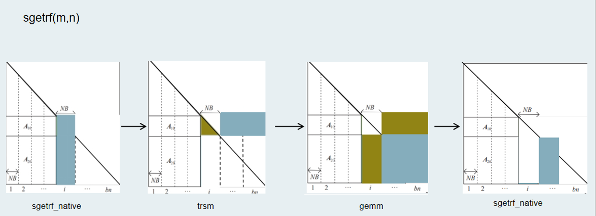
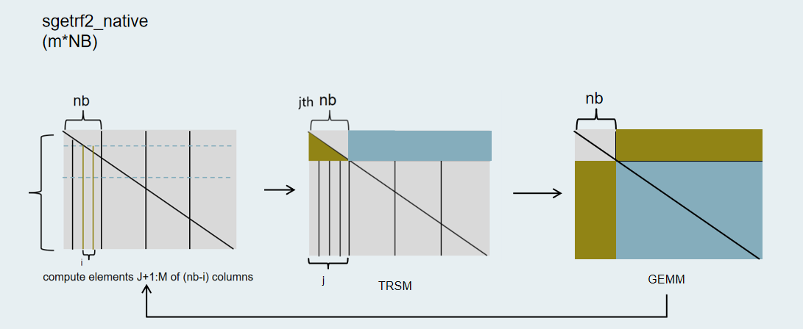
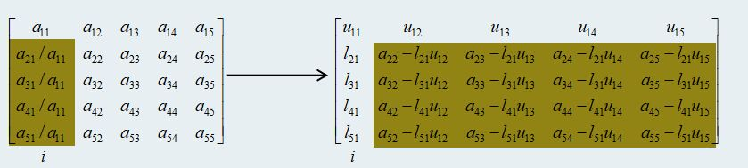
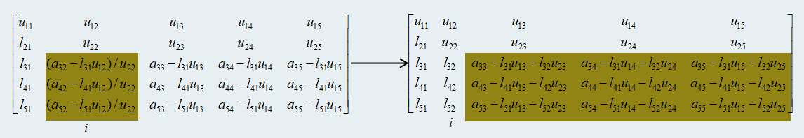

# LU分解实现方案

## 1.LU分解原理

LU分解将原矩阵A分解为一个下三角矩阵L（Lower triangular matrix）和一个上三角矩阵U（Upper triangular matrix）的乘积,其中下三角矩阵L的元素为：为了消去这个位置所乘乘数的相反数。上三角U矩阵的元素为对原矩阵进行高斯消去后的结果。


一个选主元的串行LU分解算法的步骤如下：


在LU分解的串行计算是按照颜色顺序依次计算的，比如要计算L中的元素,需要减去左侧元素和上方元素之和然后除以对角线元素：,在计算U中的元素时同样需要减去其左侧元素和其上方元素：，可以看出L和U矩阵中每个元素的计算依赖于左侧和上方的元素，导致数据必须按照依赖关系进行。

所以对于同一列的值可以用向量矩阵乘批量计算，为了计算元素需要减去的减数可以这么计算：，且

 

而对同行不同列的元素进行计算时，之间存在相同的元素，如果此时在合并计算时，需要注意他们之间还存在依赖。通过分块将串行计算转化为矩阵乘法，此时应该需要注意块外的依赖和块内的依赖，

## 2.实现方案设计

LU分解共分为两个过程，分别代表了在不同层次和分块尺寸上对矩阵进行分解。

- 首先看最外层的过程(按照图示箭头方向执行)：

 

该过程中输入的矩阵规模为(m,n)，主要是将输入的矩阵分解成大小为nb的列条块，分块的尺寸根据输入矩阵的规模决定，范围大致在128-512之间，将宽度为nb大小的列条块输入到下一层分解算法sgetrf2_native中去，蓝色表示当前正在处理的部分，绿色表示进行当前运算的输入，也代表已经完成的部分。




- 过程2 sgetrf2_native中输入的矩阵为过程1中输入的宽度为NB的列条块，这是内层的分解算法。它先将输入的矩阵继续分解为nb大小的小列条块，这里的nb取值为8，然后对每一个小列条块的每一列进行循环：找出当前第i列的最大元、进行行交换、计算当前主元下方和右侧的子矩阵元素。

完成后对下一个小列条块进行更新：通过矩阵求逆运算trsm将结果矩阵写在(j,j+nb)位置，然后通过矩阵乘运算gemm更新(j+nb,j+nb)处的矩阵。

在sgetrf2_native的分解算法中，对每个大小为nb的列条块进行循环处理的kernel是scal_ger内核。

- 计算原理说明：

​	该内核非主元部分的逻辑如下：对于图中的矩阵，首先对第i列矩阵的第二行到最后一行的元素都除以主元（第i个对角线元素），然后对其右侧的矩阵进行尾部矩阵更新，如此可以得到第i列的L矩阵元素和第i+1行的U元素；



然后如此迭代往复，直到完成nb大小的列条块的计算。



- 拆分：

​	由于行与行之间不存在数据依赖，所以行与行之间可以实现并行。在该内核MLU端的单batch实现中，开启了8个cluster的任务，共24个core对输入矩阵的行数m进行拆分，然后每个内核负责处理拆分后对应的行数。

- MLUKernelScal_ger:

​	该内核一次性开启处理一个nb大小的列条块所需要的矩阵并将数据加载到对应的NRAM上，然后循环调用子内核进行运算。

- 处理逻辑：

​	首先将整个矩阵加载到NRAM上（如果NRAM空间不够大则分多次装入），在实际的调优过程中发现2D拷贝对性能的影响非常大，为了减少2D拷贝的开销，适应矩阵运算单元BANGC的接口（不能跨地址访存），先将整个矩阵加载到NRAM后进行一次转置，然后进行运算，整个列条块计算完毕后再进行一次转置。此外，每个core在计算时需要依赖当前矩阵的第一行元素，所以每个core额外的把依赖的矩阵当做自己需要处理的部分，用计算换core之间的通信开销。

```c
__mlu_entry__ void MLUKernelScal_ger(
    int M_size, int N_size, int ib, int J,
    int m, int n, int step,
    float *dA, int lda,
    int *info, int gbstep)
{
    int tx = taskIdX;
    int gbj, STEP;
    __nram__ float shared_y[N * N];
    __nram__ float extra_vec[N * N];
    __nram__ float temp[MAX_M_SIZE  / TaskUnion4];
    __nram__ float L1[MAX_M_SIZE * N  / TaskUnion4];
    __nram__ float temp_L1[MAX_M_SIZE  / TaskUnion4];
    __nram__ float tail[MAX_M_SIZE  / TaskUnion4];
    __nram__ float orig[MAX_M_SIZE * N / TaskUnion4];
    const int seg = CEILDIV(m, MAX_M_SIZE);
    int mm_per_core_ = 0;
    __memcpy(extra_vec, A, n * sizeof(float), GDRAM2NRAM, n * sizeof(float), lda * sizeof(float), n - 1);
    for (int k = 0; k < seg; k++)
    {
        int remain_m = m - k * MAX_M_SIZE;
        int mp = remain_m < MAX_M_SIZE ? remain_m : MAX_M_SIZE;
        int m_per_core = mp / taskDim;
        int m_per_core_ = m_per_core;
        int m_ = mp - m_per_core * (taskDim - 1);
        if (tx == taskDim - 1)
        {
            m_per_core = m_;
        }

        int offset = tx * m_per_core_ + k * lda * MAX_M_SIZE;
        int len_extra = 0;

        if (!(m_per_core_ == 0 && tx != taskDim - 1))
        {
            if (offset <= n)
            {
                len_extra = offset;
            }
            else
            {
                len_extra = n;
            }
            len_extra = len_extra < 0 ? 0 : len_extra;

            if (len_extra > 0)
                __memcpy(orig, extra_vec, n * sizeof(float), NRAM2NRAM, n * sizeof(float), n * sizeof(float), len_extra - 1);
            __memcpy(orig + len_extra * n, A + tx * lda * m_per_core_ + k * lda * MAX_M_SIZE, n * sizeof(float), GDRAM2NRAM, n * sizeof(float), lda * sizeof(float), m_per_core - 1);
        }

        int m_e = m_per_core + len_extra;
        int ld_L1 = m_e;
        int mm_per_core = m_per_core;

        int llen_extra = len_extra;

        if (mm_per_core_ == 0)
        {
            if (k == 0)
                mm_per_core_ = m_per_core;
        }

        if (m_e > 0)
            __bang_transpose(L1, orig, m_e, n);
        for (STEP = 0; STEP < ib; STEP++)
        {
            gbj = J + STEP;
            if (gbj < M_size)
            {
                if (m_per_core_ == 0 && m_per_core == 0)
                    return;

                int cur = (m_per_core_ == 0) ? (taskDim - 1 + STEP / mm_per_core_ * taskDim) : STEP / m_per_core_;

                MLUSubKernelScal_ger(m - gbj, ib - STEP, STEP,
                                     A, lda, ld_L1,
                                     info, gbstep,
                                     m_per_core, m_per_core_, len_extra, k, cur,
                                     shared_y,
                                     temp,
                                     L1,
                                     temp_L1,
                                     tail,
                                     orig);

                if ((tx + k * taskDim) == cur && m_per_core > 0)
                    m_per_core--;
                else if (len_extra > 0)
                    len_extra--;
                if (m_per_core == 0)
                    break;
            }
        }
        if (m_e > 0)
            __bang_transpose(orig, L1, n, m_e);
        if (mm_per_core - 1 >= 0)
        {
            __memcpy(A + tx * lda * m_per_core_ + k * lda * MAX_M_SIZE, orig + llen_extra * n, n * sizeof(float), NRAM2GDRAM, lda * sizeof(float), n * sizeof(float), mm_per_core - 1);
        }
        return
    }
```


- MLUSubkernelScal_ger:

​	该内核主要是计算当前主元下方的元素并对右侧的子矩阵进行更新，参照计算原理处的说明。

```c
__mlu_func__ void MLUSubKernelScal_ger(
    int m, int n, int step,
    float *dA, int lda, int ldL1,
    int *info, int gbstep,
    int m_per_core, int m_per_core_, int len_extra, int k, int cur,
    __nram__ float *shared_y,
    __nram__ float *temp,
    __nram__ float *L1,
    __nram__ float *temp_L1,
    __nram__ float *tail,
    __nram__ float *orig)
{
    int tx = taskIdX;

    // checkinfo to avoid computation of the singular matrix
    if ((*info) != 0)
        return;
    if (m_per_core <= 0)
        return;

    int ld_orig = n + step;

    if (step == 0)
        __memcpy(shared_y, orig, n * sizeof(float), NRAM2NRAM, n * sizeof(float), lda * sizeof(float), 0);
    else
    {
        orig = orig + step + step * ld_orig;
        L1 = L1 + step + step * ldL1;
        
        __memcpy(shared_y, L1, 1 * sizeof(float), NRAM2NRAM, 1 * sizeof(float), ldL1 * sizeof(float), n - 1);
    }

    if (shared_y[0] == 0)
    {
        (*info) = step + gbstep + 1;
        return;
    }

    int offset_L1 = 0;

    if (tx == 0 || (tx == taskDim - 1 && m_per_core_ == 0)) 
    {
        if (step == 0 && k == 0)
        {
            m_per_core--;
            offset_L1++; 
        }
    }
    if (k > 0)
    {
        if (((tx + k * taskDim) == cur) && (m_per_core == 1))
        {
            return;
        }
    }

    float reg;
    reg = 1 / shared_y[0];
    int of = (step == 0) ? 0 : 1;

    if (m_per_core > 0)
    {
        if (m_per_core + len_extra - of > 0)
            __bang_mul_scalar(temp_L1 + offset_L1, L1 + offset_L1 + of, reg, m_per_core + len_extra - of);

        for (int i = 0; i < n - 1; i++)
        {
            if (m_per_core + len_extra - of > 0)
            {
                __bang_cycle_mul(temp, temp_L1 + offset_L1, shared_y + i + 1, m_per_core + len_extra - of, 1);
                __bang_sub(L1 + offset_L1 + (i + 1) * (ldL1) + of, L1 + offset_L1 + (i + 1) * (ldL1) + of, temp, m_per_core + len_extra - of);
            }
        }

        if (m_per_core - 1 >= 0)
        {
            if ((m_per_core + len_extra - of) > 0)
                __memcpy(L1 + offset_L1 + of, temp_L1 + offset_L1, (m_per_core + len_extra - of) * sizeof(float), NRAM2NRAM, ldL1 * sizeof(float), sizeof(float), 0); 
        }
    }

}
```


- 性能优化设计

  - 资源分配

    | 表项  | 分配策略                                                     |
    | ----- | ------------------------------------------------------------ |
    | NRAM  | 将输入矩阵加载到NRAM上，如果NRAM空间不足，则分块装入，然后再进行一次转置 |
    | WRAM  | 未使用                                                       |
    | SRAM  | 未使用                                                       |
    | GDRAM | 输入矩阵和输出矩阵                                           |

  - 流水设计

    暂无

  - 优化设计

    1.每个core在进行运算时需要依赖到当前的主元所在行元素，在开启多个cluster时，每个core额外的把依赖的矩阵当做自己需要处理的部分，在多batch情况下只启用一个cluster时，将这部分依赖的数据放在sram来减少每个core的计算量；

## 4.MLU层需求分析

### 4.1.算子需求分析

| 算子功能简介                                                 | LU分解              |
| ------------------------------------------------------------ | ------------------- |
| 需求来源                                                     | pytorch             |
| 应用网络                                                     |                     |
| 输入数据类型                                                 | float/complex float |
| 输入shape                                                    | [batch,M,N]         |
| 输入layout                                                   | array               |
| 输出数据类型                                                 | float/complex float |
| 输出shape                                                    | [batch,M,N]         |
| 输出layout                                                   | array               |
| 模式                                                         | pivot/no pivot      |
| 是否含有 dim/axis 等类似语义的参数且该参数支持负数/其他特殊处理 | 否                  |
| 是否含有 labels/index 等类似语义的参数且该参数支持负数/界外情况/其他特殊处理 | 否                  |
| 是否需要支持原位                                             | 是                  |
| 是否需要支持stride机制                                       | 是                  |
| 是否需要支持广播                                             | 否                  |
| 0元素检查是否直接返回                                        | 否                  |
| 其他特殊需求                                                 | 无                  |
| 本次开发优先支持的规模/模式                                  |                     |

### 4.2.LU分解算子功能和应用场景描述

LU 分解的功能是将原始矩阵 A 分解为两个矩阵 L 和 U，满足 A = LU。其中，L 是一个下三角矩阵，其对角线元素为 1，上三角元素全为 0，而 U 是一个上三角矩阵，其下三角元素全为 0。通过 LU 分解，我们可以将原始线性方程组 Ax = b 转化为 LUx = b，进而可以通过回代求解步骤求解出 x。

### 4.3.算子输入输出参数要求

| 参数        | 语义               | 类型      | 支持类型             | 物理布局 | 规模限制         |
| ----------- | ------------------ | --------- | -------------------- | -------- | ---------------- |
| handle      |                    | 句柄      |                      |          |                  |
| Input_desc  | 矩阵描述符         | 输入      |                      |          |                  |
| Input       | 输入矩阵           | 输入/输出 | float、complex float | array    | shape[batch,M,N] |
| output_desc | 矩阵描述符         | 输入      |                      |          |                  |
| output      | 输入矩阵           | 输入/输出 | float、complex float | array    | shape[batch,M,N] |
| mode        | 模式pivot/no pivot | 输入      | bool                 |          |                  |

### 4.4. **算子接口设计**

mluOpStatus_t mluOp_WIN_API mluOpLUFactorization(mluOpHandle_t handle, const mluOpTensorDescriptor_t input_desc, void *input,const mluOpTensorDescriptor_t output_desc, void *output,const bool mode);

### 4.5.测试用例设计

在单batch下的测试用例规模如表格：

| shape | size         | size        | size     | size       | size        |
| :---: | ------------ | ----------- | -------- | ---------- | ----------- |
| [m,n] | [1,65536]    | [64,64]     | [3,3]    | [64,32]    | [128,1]     |
| [m,n] | [65536,3000] | [65536,30]  | [1,1024] | [15200,15] | [1024,1024] |
| [m,n] | [3200,3000]  | [8000,3000] |          |            |             |

### 4.6.算子参数检查

1.handle为空检查；

2.检查输入输出支持的dtype以及shape；

3.算子自身参数检查，检查支持的分解模式，目前只支持非主元；

4.指针为空检查；

5.主元的0元素检查；