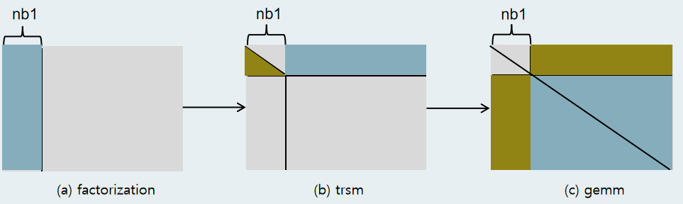

# LU分解实现方案

## 1.LU分解原理

LU分解将原矩阵A分解为一个下三角矩阵L（Lower triangular matrix）和一个上三角矩阵U（Upper triangular matrix）的乘积,其中下三角矩阵L的元素为：为了消去这个位置所乘乘数的相反数。上三角U矩阵的元素为对原矩阵进行高斯消去后的结果。


一个选主元的串行LU分解算法的步骤如下：


在LU分解的串行计算是按照颜色顺序依次计算的，比如要计算L中的元素,需要减去左侧元素和上方元素之和然后除以对角线元素：,在计算U中的元素时同样需要减去其左侧元素和其上方元素：，可以看出L和U矩阵中每个元素的计算依赖于左侧和上方的元素，导致数据必须按照依赖关系进行。

所以对于同一列的值可以用向量矩阵乘批量计算，为了计算元素需要减去的减数可以这么计算：，且

 

而对同行不同列的元素进行计算时，之间存在相同的元素，如果此时在合并计算时，需要注意他们之间还存在依赖。通过分块将串行计算转化为矩阵乘法，此时应该需要注意块外的依赖和块内的依赖，

## 2.实现方案设计

LU分解共分为两个过程，分别代表了在不同层次和分块尺寸上对矩阵进行分解。

- 首先看最外层的过程(按照图示箭头方向执行)：

 

该过程中输入的矩阵规模为(m,n)，主要是将输入的矩阵分解成大小为nb的列条块，分块的尺寸根据输入矩阵的规模决定，范围大致在128-512之间，将宽度为nb大小的列条块输入到下一层分解算法sgetrf2_native中去，蓝色表示当前正在处理的部分，绿色表示进行当前运算的输入，也代表已经完成的部分。




- 过程2 sgetrf2_native中输入的矩阵为过程1中输入的宽度为NB的列条块，这是内层的分解算法。它先将输入的矩阵继续分解为nb大小的小列条块，这里的nb取值为8，然后对每一个小列条块的每一列进行循环：找出当前第i列的最大元、进行行交换、计算当前主元下方和右侧的子矩阵元素。

完成后对下一个小列条块进行更新：通过矩阵求逆运算trsm将结果矩阵写在(j,j+nb)位置，然后通过矩阵乘运算gemm更新(j+nb,j+nb)处的矩阵。

在sgetrf2_native的分解算法中，对每个大小为nb的列条块进行循环处理的kernel是scal_ger内核。

- 计算原理说明：

  该内核非主元部分的逻辑如下：对于图中的矩阵，首先对第i列矩阵的第二行到最后一行的元素都除以主元（第i个对角线元素），然后对其右侧的矩阵进行尾部矩阵更新，如此可以得到第i列的L矩阵元素和第i+1行的U元素；


然后如此迭代往复，直到完成nb大小的列条块的计算。


- 拆分：

  由于行与行之间不存在数据依赖，所以行与行之间可以实现并行。在该内核MLU端的单batch实现中，开启了8个cluster的任务，共24个core对输入矩阵的行数m进行拆分，然后每个内核负责处理拆分后对应的行数。

- MLUKernelScal_ger:

  该内核一次性开启处理一个nb大小的列条块所需要的矩阵并将数据加载到对应的NRAM上，然后循环调用子内核进行运算。

- 算法逻辑：

  首先将整个矩阵加载到NRAM上（如果NRAM空间不够大则分多次装入），在实际的调优过程中发现2D拷贝对性能的影响非常大，为了减少2D拷贝的开销，适应矩阵运算单元BANGC的接口（不能跨地址访存），先将整个矩阵加载到NRAM后进行一次转置，然后进行运算，整个列条块计算完毕后再进行一次转置。此外，每个core在计算时需要依赖当前矩阵的第一行元素，所以每个core额外的把依赖的矩阵当做自己需要处理的部分，用计算换core之间的通信开销。

- MLUKernelScal_ger实数非主元底层分解算法详解

- - 多任务类型：

  - - 当batch数量大于1时，使用1个cluster对应1个batch;

  - - 当batch数量等于1时，使用实际的cluster数量（默认为8个）对应1个batch;

    - ```c
      if (batch > 1)
         {
             id = taskId;
             batch_id = id / 4;
             if (batch_id >= batch)
                 return;
             tx = taskId % 4;
             dA += batch_id * stride_a;
             taskdim = TaskUnion1;
         }
         else
         {
             id = taskId;
             batch_id = 0;
             taskdim = taskDim;
             tx = taskId;
         }
      ```

  - 变量与数据的对应

  - - ```c
      __nram__ float shared_y[N * N];//存储每次分解时的第一行元素
      __nram__ float extra_vec[N * N];//存储额外行
      __nram__ float temp[MAX_M_SIZE * +N];//存储当前主元下方的一列元素
      __nram__ float temp_L1[MAX_M_SIZE + N];//存储当前主元下方的一列元素（经过计算更新后）
      __nram__ float L1[MAX_M_SIZE * N + N * N];//存储当前主元右下方的尾部矩阵（已转置）
      __nram__ float orig[MAX_M_SIZE * N + N * N];//每个core包含额外行和工作行的整个矩阵（未转置）
      ```

    - 

  - 任务切分

  - - 额外行的数量最大不超过n(列数)，并保存到extra_vec变量中；

    - 当输入的m不超过MAX_M_SIZE(每个core能分配的最大NRAM对应的M) * taskdim(多任务类型)时，将m按taskdim进行等分，余出的部分平均分给前m_个core;

    - 当输入的m大于MAX_M_SIZE(每个core能分配的最大NRAM对应的M) * taskdim(多任务类型)时，将m分多轮迭代；

    - m_last_seg为了处理最后一个seg中，m_不为0的情况（前m__个core和后面的core工作行数量不一致)

    - ```c
      const int C_MAX_M_SIZE = MAX_M_SIZE * taskdim;
      const int seg = CEILDIV(m, C_MAX_M_SIZE);
      // n个额外行
      __memcpy(extra_vec, A, n * sizeof(float), GDRAM2NRAM, n * sizeof(float), lda * sizeof(float), n - 1);
      for (int k = 0; k < seg; k++)
      {
          int remain_m = m - k * C_MAX_M_SIZE;
          int mp = remain_m < C_MAX_M_SIZE ? remain_m : C_MAX_M_SIZE;
          int m_per_core = mp / taskdim;
          int m_per_core_ = m_per_core;
          int m_ = mp % taskdim;
          if (tx <= m_ - 1)//余出的m_平均分给前m_个core
          {
              m_per_core++;
              m_per_core_++;
          }
          int m_last_seg = tx > m_ - 1 ? m_ : 0;//特殊处理最后一个seg
          int len_extra = 0;
          int offset = tx * m_per_core_ + k * lda * C_MAX_M_SIZE;
          len_extra = offset <= n ? offset + m_last_seg : n;
          if (len_extra - 1 >= 0)
              __memcpy(orig, extra_vec, n * sizeof(float), NRAM2NRAM, n * sizeof(float), n * sizeof(float), len_extra - 1);
          if (m_per_core - 1 >= 0)
              __memcpy(orig + len_extra * n, A + tx * lda * m_per_core_ + m_last_seg * lda + k * lda * C_MAX_M_SIZE, n * sizeof(float), GDRAM2NRAM, n * sizeof(float), lda * sizeof(float), m_per_core - 1);
          ......
      }
      ```

  - 循环部分

  - - cur表示当前进行到的位置，当满足((tx + k * taskdim + m_last_seg) == (cur)时，每个core开始处理自己的工作行，然后m_per_core--，在此之前都是在处理额外行；

  - - ```c
      for (STEP = 0; STEP < ib; STEP++)
      {
          gbj = J + STEP;
          if (gbj < M_size)
          {
              if (m_per_core_ == 0)
                  return;
      
              int cur = STEP / m_per_core_;
      
              MLUSubKernelScal_ger(m - gbj, ib - STEP, STEP, taskdim, batch,
                                   A, lda, ld_L1,
                                   info, gbstep,
                                   m_per_core, m_per_core_, len_extra, k, cur, m_last_seg,
                                   shared_y,
                                   temp,
                                   L1,
                                   temp_L1,
                                   orig);
      
              if (((tx + k * taskdim + m_last_seg) == (cur)) && (m_per_core > 0))
                  m_per_core--;
              else if (len_extra > 0)
                  len_extra--;
              if (m_per_core == 0)
                  break;
          }
      }
      ```

      

完整代码：

```c
__mlu_entry__ void MLUKernelScal_ger(
    int batch, int M_size, int N_size, int ib, int J,
    int m, int n, int step,
    float *dA, int lda, int stride_a,
    int *info, int gbstep)
{
    // printf("%d KB used\n", ((MAX_M_SIZE * N + N * N) * 2 + N * N * 2 + (MAX_M_SIZE + N) * 2) * 4);
    int id, batch_id, tx, taskdim;
    if (batch > 1)
    {
        id = taskId;
        batch_id = id / 4;
        if (batch_id >= batch)
            return;
        tx = taskId % 4;
        dA += batch_id * stride_a;
        taskdim = TaskUnion1;
    }
    else
    {
        id = taskId;
        batch_id = 0;
        taskdim = taskDim;
        tx = taskId;
    }
    int gbj, STEP;
    __nram__ float shared_y[N * N];
    __nram__ float extra_vec[N * N];
    __nram__ float temp[MAX_M_SIZE * +N];
    __nram__ float L1[MAX_M_SIZE * N + N * N];
    __nram__ float temp_L1[MAX_M_SIZE + N];
    __nram__ float orig[MAX_M_SIZE * N + N * N];

    float *A = dA + J + J * lda;

    if (1)
    {
        const int C_MAX_M_SIZE = MAX_M_SIZE * taskdim;
        const int seg = CEILDIV(m, C_MAX_M_SIZE);
        // n个额外行
        __memcpy(extra_vec, A, n * sizeof(float), GDRAM2NRAM, n * sizeof(float), lda * sizeof(float), n - 1);

        for (int k = 0; k < seg; k++)
        {
            int remain_m = m - k * C_MAX_M_SIZE;
            int mp = remain_m < C_MAX_M_SIZE ? remain_m : C_MAX_M_SIZE;
            int m_per_core = mp / taskdim;
            int m_per_core_ = m_per_core;
            int m_ = mp % taskdim;
            if (tx <= m_ - 1)
            {
                m_per_core++;
                m_per_core_++;
            }
            int m_last_seg = tx > m_ - 1 ? m_ : 0;
            int len_extra = 0;
            int offset = tx * m_per_core_ + k * lda * C_MAX_M_SIZE;
            len_extra = offset <= n ? offset + m_last_seg : n;
            if (len_extra - 1 >= 0)
                __memcpy(orig, extra_vec, n * sizeof(float), NRAM2NRAM, n * sizeof(float), n * sizeof(float), len_extra - 1);
            if (m_per_core - 1 >= 0)
                __memcpy(orig + len_extra * n, A + tx * lda * m_per_core_ + m_last_seg * lda + k * lda * C_MAX_M_SIZE, n * sizeof(float), GDRAM2NRAM, n * sizeof(float), lda * sizeof(float), m_per_core - 1);

            int m_e = m_per_core + len_extra;   // 转置后L1的主矩阵维度
            int ld_L1 = m_e;                    // 转置后L1的主矩阵维度
            const int mm_per_core = m_per_core; // 保留额外行和工作行的常量副本
            const int llen_extra = len_extra;

            // 将原数组转置
            if (m_e > 0)
                __bang_transpose(L1, orig, m_e, n);

            for (STEP = 0; STEP < ib; STEP++)
            {
                gbj = J + STEP;
                if (gbj < M_size)
                {
                    if (m_per_core_ == 0)
                        return;
                   
                    int cur = STEP / m_per_core_;

                    MLUSubKernelScal_ger(m - gbj, ib - STEP, STEP, taskdim, batch,
                                         A, lda, ld_L1,
                                         info, gbstep,
                                         m_per_core, m_per_core_, len_extra, k, cur, m_last_seg,
                                         shared_y,
                                         temp,
                                         L1,
                                         temp_L1,
                                         orig);

                    if (((tx + k * taskdim + m_last_seg) == (cur)) && (m_per_core > 0))
                        m_per_core--;
                    else if (len_extra > 0)
                        len_extra--;
                    if (m_per_core == 0)
                        break;
                }
            }
            // 转置回
            if (m_e > 0)
                __bang_transpose(orig, L1, n, m_e);
           
            if (mm_per_core - 1 >= 0)
            {
                __memcpy(A + tx * lda * m_per_core_ + m_last_seg * lda + k * lda * C_MAX_M_SIZE, orig + llen_extra * n, n * sizeof(float), NRAM2GDRAM, lda * sizeof(float), n * sizeof(float), mm_per_core - 1);
            }
        }
        return;
    }
}
```


- MLUSubkernelScal_ger算法逻辑:

  该内核主要是计算当前主元下方的元素并对右侧的子矩阵进行更新，算法原理参照计算原理处的说明。

- - ①__bang_mul_scalar对应第一列元素的除法运算过程；
  - ②__bang_cycle_mul对应①的一列矩阵和shared_y的每一个元素进行循环向量乘的过程；
  - ③__bang_sub对应尾部矩阵L1和②后的矩阵进行减法运算；
  - of表示对变量位置的偏移

```c
__mlu_func__ void MLUSubKernelScal_ger(
    int m, int n, int step, int taskdim, int batch,
    float *dA, int lda, int ldL1,
    int *info, int gbstep,
    int m_per_core, int m_per_core_, int len_extra, int k, int cur, int m_last_seg,
    __nram__ float *shared_y,//存储每次计算时的第一行元素
    __nram__ float *temp,
    __nram__ float *L1,//存储
    __nram__ float *temp_L1,
    __nram__ float *orig)
{
    int tx = batch > 1 ? taskId % 4 : taskId;
    // printf("SubKernelScal_ger tx %d\n", tx);

    // checkinfo to avoid computation of the singular matrix
    if ((*info) != 0)
        return;
    if (m_per_core <= 0)
        return;
    int ld_orig = n + step;

    // printf("tx step m_per_core m_per_core_ len_extra %d %d %d %d %d\n", tx, step, m_per_core, m_per_core_, len_extra);
    if (step == 0)
        __memcpy(shared_y, orig, n * sizeof(float), NRAM2NRAM, n * sizeof(float), lda * sizeof(float), 0);
    else
    {
        orig = orig + step + step * ld_orig;
        L1 = L1 + step + step * ldL1;

        __memcpy(shared_y, L1, 1 * sizeof(float), NRAM2NRAM, 1 * sizeof(float), ldL1 * sizeof(float), n - 1);
    }

    if (shared_y[0] == 0)
    {
        (*info) = step + gbstep + 1;
        return;
    }

    int offset_L1 = 0;

    if (((tx + k * taskdim + m_last_seg) == cur) && (m_per_core == 1))
    {
        return;
    }

    if ((step == 0) && (k == 0) && (tx == 0))//特殊处理该情况，表示当前行不需要处理，直接处理下一行
    {
        m_per_core--;
        offset_L1++; // 指向shared_y的第二个元素
    }

    float reg;
    reg = 1 / shared_y[0];
    int of = (step == 0) ? 0 : 1;

    if (m_per_core > 0)
    {
        if (m_per_core + len_extra - of > 0)
            __bang_mul_scalar(temp_L1 + offset_L1, L1 + offset_L1 + of, reg, m_per_core + len_extra - of);

        for (int i = 0; i < n - 1; i++)
        {
            if (m_per_core + len_extra - of > 0)
            {
                __bang_cycle_mul(temp, temp_L1 + offset_L1, shared_y + i + 1, m_per_core + len_extra - of, 1);
                __bang_sub(L1 + offset_L1 + (i + 1) * (ldL1) + of, L1 + offset_L1 + (i + 1) * (ldL1) + of, temp, m_per_core + len_extra - of);
            }
        }

        if (m_per_core - 1 >= 0)
        {
            if ((m_per_core + len_extra - of) > 0)
                __memcpy(L1 + offset_L1 + of, temp_L1 + offset_L1, (m_per_core + len_extra - of) * sizeof(float), NRAM2NRAM, ldL1 * sizeof(float), sizeof(float), 0); // 写回第一列
        }
    }
}
```

- MLUKernelScal_ger_pivot实数选主元底层分解算法详解

  * 在非主元分解算法的基础上增加了选主元的步骤(PivotSwap)，根据m的尺寸选取选主元的内核，MLUKernelPivotSwap采用Union1任务类型，核间通信时用SRAM暂存中间值并进行主元的选取；MLUKernelPivotSwap2采用Union8任务类型，核间通信时用GDRAM暂存中间值并进行主元的选取；
  * 关键代码如下：

  ```c++
  for (STEP = 0; STEP < ib; STEP++)
  {
      gbj = J + STEP;
      if (gbj < M_size)
      {
          if (m > MAX_M_SIZE1 * TaskUnion1)
          {
              MLUKernelPivotSwap2(m - gbj, ib - STEP, STEP,
                                  batch, M_size, N_size,
                                  A, lda, stride_a, workspace,
                                  L1, ld_L1, orig, n, len_extra, m_e,
                                  max_arr, max_arr_vec, max_idx, max_gbidx, shared_y,
                                  tx, taskdim, batch_id,
                                  m_per_core, mp_,
                                  dipiv, dipiv2, info, gbstep);
          }
  
          else
          {
  
              MLUKernelPivotSwap(m - gbj, ib - STEP, STEP,
                                 batch, M_size, N_size,
                                 A, lda, stride_a, workspace,
                                 L1, ld_L1, orig, n, len_extra, m_e,
                                 max_arr, max_arr_vec, max_idx, shared_y,
                                 tx, taskdim, batch_id,
                                 m_per_core, mp_,
                                 dipiv, dipiv2, info, gbstep);
          }
  
          MLUSubKernelScal_ger_pivot(m - gbj, ib - STEP, STEP, taskdim, batch,
                                     A, lda, ld_L1,
                                     info, gbstep,
                                     m_per_core, m_per_core_, len_extra, k, m_e,
                                     shared_y,
                                     temp,
                                     L1,
                                     orig);
  
          m_e--;
      }
  }
  ```

  * 受限于片上空间的大小，当输入矩阵的规模非常大时，需要牺牲部分性能并交换分块和按列循环计算的顺序，适应算法的通用性，具体代码如下：

  ```
  if (m > MAX_M_SIZE1 * TaskUnion8)
  {
  
      int mp = m / taskdim;
      const int mp_ = mp;
      mp = (tx == taskdim - 1) ? m % taskdim + mp : mp;
  
      int seg = CEILDIV(mp, MAX_M_SIZE1);
  
      __mlu_shared__ int shared_seg[TaskUnion1];
      shared_seg[tx] = seg;
      __sync_cluster();
  
      seg = shared_seg[0];
      int m_e;
      for (STEP = 0; STEP < ib; STEP++)
      {
          gbj = J + STEP;
          for (int k = 0; k < seg; k++)
          {
              int remain_m = mp - k * MAX_M_SIZE1;
              int m_per_core = remain_m < MAX_M_SIZE1 ? remain_m : MAX_M_SIZE1;
              m_per_core = ((tx == taskdim - 1) && (k == seg - 1)) ? remain_m : m_per_core;
              const int m_per_core_ = m_per_core;
  
              int offset = tx * mp_ + k * MAX_M_SIZE1;
              int len_extra = offset <= n ? offset : n;
  
              if (m_per_core - 1 >= 0)
                  __memcpy(orig, A + STEP + tx * lda * mp_ + k * lda * MAX_M_SIZE1, 1 * sizeof(float), GDRAM2NRAM, 1 * sizeof(float), lda * sizeof(float), m_per_core - 1);
  
              m_e = m_per_core + len_extra;
              m_e = (k > 0) ? m_per_core - STEP : m_e - STEP;
              if (gbj < M_size)
              {
                  MLUKernelPivot(m - gbj, ib - STEP, STEP,
                                 batch, M_size, N_size, k,
                                 A, lda, stride_a,
                                 orig, 1, len_extra, m_e,
                                 k_max, k_max_idx, k_max_gbidx,
                                 tx, taskdim, batch_id,
                                 mp, mp_, m_per_core, m_per_core_,
                                 dipiv, dipiv2, info, gbstep);
              }
          }
  
          MLUKernelKSwap(m - gbj, ib - STEP, STEP,
                         batch, M_size, N_size,
                         A, lda, stride_a,
                         orig, 1, m_e,
                         k_max, k_max_idx, k_max_gbidx, k_max_arr,
                         tx, taskdim, batch_id,
                         mp, mp_,
                         dipiv, dipiv2, info, gbstep);
  
          __memcpy(shared_y, A + STEP + STEP * lda, (ib - STEP) * sizeof(float), GDRAM2NRAM);
          for (int k = 0; k < seg; k++)
          {
              int remain_m = mp - k * MAX_M_SIZE1;
              int m_per_core = remain_m < MAX_M_SIZE1 ? remain_m : MAX_M_SIZE1;
              m_per_core = ((tx == taskdim - 1) && (k == seg - 1)) ? remain_m : m_per_core;
  
              const int m_per_core_ = m_per_core;
  
              int len_extra = 0;
              int offset = tx * mp_ + k * MAX_M_SIZE1;
              len_extra = offset <= n ? offset : n;
  
              if ((len_extra - 1 >= 0 && k == 0))
                  __memcpy(orig, extra_vec_nram, n * sizeof(float), NRAM2NRAM, n * sizeof(float), n * sizeof(float), len_extra - 1);
              if (m_per_core - 1 >= 0)
                  __memcpy(orig + len_extra * n, A + tx * lda * mp_ + k * lda * MAX_M_SIZE1, n * sizeof(float), GDRAM2NRAM, n * sizeof(float), lda * sizeof(float), m_per_core - 1);
  
              m_e = m_per_core + len_extra;
              const int m_e1 = m_e;
              int ld_L1 = m_e;
              const int mm_per_core = m_per_core;
              const int llen_extra = len_extra;
  
              if (m_e > 0)
                  __bang_transpose(L1, orig, m_e, n);
  
              m_e = (k > 0) ? m_per_core - STEP : m_e - STEP;
  
              if (gbj < M_size)
              {
  
                  MLUSubKernelScal_ger_pivot(m - gbj, ib - STEP, STEP, taskdim, batch,
                                             A, lda, ld_L1,
                                             info, gbstep,
                                             m_per_core, m_per_core_, len_extra, k, m_e,
                                             shared_y,
                                             temp,
                                             L1,
                                             orig);
              }
  
              if (m_e1 > 0)
                  __bang_transpose(orig, L1, n, m_e1);
  
              if (mm_per_core - 1 >= 0)
              {
                  __memcpy(A + tx * lda * mp_ + k * lda * MAX_M_SIZE1, orig + llen_extra * n, n * sizeof(float), NRAM2GDRAM, lda * sizeof(float), n * sizeof(float), mm_per_core - 1);
              }
          }
      }
  }
  ```


- 性能优化设计

  - 性能分析

    LU分解中的主要kernel包括：scal_ger——最内层分解kernel、gemm、trsm。其中gemm的实现方式是从host端拼接调用矩阵乘算子，通常情况下时间开销占比最大，而由于算法库中缺少trsm相关功能的实现，在自行实现的过程中由于计算顺序上的依赖导致计算时有大量的标量计算，不能很好地利用向量化接口，如果算法库中拓展一版优化的trsm将会大大减小这部分的时间占比。在最内层的分解内核scal_ger中，该内核的时间开销大部分来自于二维内存拷贝操作，当输入矩阵过大时，需要对输入矩阵在行维度上进行任务切分，每个计算单元处理矩阵的一部分。受限于片上空间的不足，数据必须分批处理，当使用NRAM或SRAM和GDRAM进行数据交换时，会产生较大的时间开销，该过程在选主元模式中体现极为明显。在选主元模式中，需根据按列选主元-计算-选主元-计算...的顺序，当片上空间不足以一次性装入足够大的矩阵时，需要分块装入计算，此时产生较大额外的时间开销。对分批次装入矩阵时一次装入矩阵的大小是影响时间因素的之一，当前代码下的诸如MAX_M_SIZE等参数的设置是根据经验设置，通常情况下能得到比较好的效果。

    

    - nb1=32; nb2=16时的kernel占比

    

    - nb1=32; nb2=32时的kernel占比

    上图表示了在1024规模下对分块的大小调整导致的性能差异。改变gemm、trsm、scal_ger等内核之间的比例也是影响时间因素的之一，动态改变sgetrf_mlu中的nb1和sgetrf2_native中的nb2两个分块大小会显著影响程序的表现，当块大小越小时，内核处理数据的规模越小，调用次数越高，当前代码中的参数设置是根据调优经验设置，在大多数情况下能得到比较好的效果。

  - 资源分配

    | 表项  | 分配策略                                                     |
    | ----- | ------------------------------------------------------------ |
    | NRAM  | 将输入矩阵加载到NRAM上，如果NRAM空间不足，则分块装入，然后再进行一次转置； |
    | WRAM  | 未使用；                                                     |
    | SRAM  | 暂存置换矩阵；行交换时的缓冲；                               |
    | GDRAM | 输入矩阵和输出矩阵；行交换时的缓冲；                         |

  - 流水设计

    暂无

  - 优化设计

    1.每个core在进行运算时需要依赖到当前的主元所在行元素，在开启多个cluster时，每个core额外的把依赖的矩阵当做自己需要处理的部分，在多batch情况下只启用一个cluster时，将这部分依赖的数据放在sram来减少每个core的计算量；

## 4.MLU层需求分析

### 4.1.算子需求分析

| 算子功能简介                                                 | LU分解              |
| ------------------------------------------------------------ | ------------------- |
| 需求来源                                                     | pytorch             |
| 应用网络                                                     |                     |
| 输入数据类型                                                 | float/complex float |
| 输入shape                                                    | [batch,M,N]         |
| 输入layout                                                   | array               |
| 输出数据类型                                                 | float/complex float |
| 输出shape                                                    | [batch,M,N]         |
| 输出layout                                                   | array               |
| 模式                                                         | pivot/no pivot      |
| 是否含有 dim/axis 等类似语义的参数且该参数支持负数/其他特殊处理 | 否                  |
| 是否含有 labels/index 等类似语义的参数且该参数支持负数/界外情况/其他特殊处理 | 否                  |
| 是否需要支持原位                                             | 是                  |
| 是否需要支持stride机制                                       | 是                  |
| 是否需要支持广播                                             | 否                  |
| 0元素检查是否直接返回                                        | 是                  |
| 其他特殊需求                                                 | 无                  |
| 本次开发优先支持的规模/模式                                  | 典型规模            |

### 4.2.LU分解算子功能和应用场景描述

LU 分解的功能是将原始矩阵 A 分解为两个矩阵 L 和 U，满足 A = LU。其中，L 是一个下三角矩阵，其对角线元素为 1，上三角元素全为 0，而 U 是一个上三角矩阵，其下三角元素全为 0。通过 LU 分解，我们可以将原始线性方程组 Ax = b 转化为 LUx = b，进而可以通过回代求解步骤求解出 x。

### 4.3.算子输入输出参数要求

mluOpXgetrf

| 参数        | 语义               | 类型      | 支持类型             | 物理布局         | 规模限制                                      |
| ----------- | ------------------ | --------- | -------------------- | ---------------- | --------------------------------------------- |
| handle      |                    | 句柄      |                      |                  |                                               |
| Input_desc  | 矩阵描述符         | 输入      |                      |                  |                                               |
| Input       | 输入矩阵           | 输入/输出 | float、complex float | shape[batch,M,N] | 所占空间不超过7GB，且单维度不得超过整型数大小 |
| output_desc | 矩阵描述符         | 输入      |                      |                  |                                               |
| output      | 输入矩阵           | 输入/输出 | float、complex float | shape[batch,M,N] | 所占空间不超过7GB，且单维度不得超过整型数大小 |
| mode        | 模式pivot/no pivot | 输入      | int                  |                  |                                               |
| dipiv_desc  | 矩阵描述符         | 输入      |                      |                  |                                               |
| dipiv       | 置换矩阵           | 输入/输出 | int*                 | shape[batch,M]   |                                               |
| info        | 执行状态           | 输入/输出 | int                  |                  |                                               |
| workspace   | 额外工作空间       | 输入      | void*                |                  |                                               |

### 4.4. 算子限制

| 限制类型     | 详细说明                                                  |
| ------------ | --------------------------------------------------------- |
| 数据类型限制 | 输入输出矩阵的类型必须是float32或者complex类型            |
| 布局限制     | 输入输出矩阵均为array                                     |
| 规模限制     | 算子输入矩阵不得超过GDRAM大小，且单维度不得超过整型数大小 |
| 功能限制     | 无                                                        |
| 数据范围限制 | mode表示是否选主元，非零为选主元模式                      |
| 原位限制     | 不支持原位                                                |
| stride限制   | 不支持stride机制                                          |
| 广播限制     | 不支持广播                                                |

### 4.5. 验收标准

一方面输出结果的动态阈值 diff1， diff2， diff3_2 精度验收通过，另一方面使用输出结果反解回的矩阵和原始输入矩阵 A 的动态阈值 diff1， diff2， diff3_2 精度验收通过。

### 4.6. **算子接口设计**

mluOpStatus_t MLUOP_WIN_API mluOpGetXgetrfWorkspaceSize(mluOpHandle_t handle, const mluOpTensorDescriptor_t x_desc, size_t *workspace_size);

mluOpStatus_t mluOp_WIN_API mluOpXgetrf(mluOpHandle_t handle, const mluOpTensorDescriptor_t x_desc, const void *x,const mluOpTensorDescriptor_t y_desc, void *y,void *workspace,const mluOpTensorDescriptor_t dipiv_desc, int *ipiv, int *info, int mode);

### 4.7. 测试用例设计

在单batch下的测试用例规模如表格：

| shape | size         | size        | size     | size       | size        |
| :---: | ------------ | ----------- | -------- | ---------- | ----------- |
| [m,n] | [1,65536]    | [64,64]     | [3,3]    | [64,32]    | [128,1]     |
| [m,n] | [65536,3000] | [65536,30]  | [1,1024] | [15200,15] | [1024,1024] |
| [m,n] | [3200,3000]  | [8000,3000] |          |            |             |

### 4.8. 算子参数检查

1.handle为空检查；

2.检查输入输出支持的dtype以及shape；

3.算子自身参数检查，检查支持的分解模式；

4.指针为空检查；

5.主元的0元素检查；