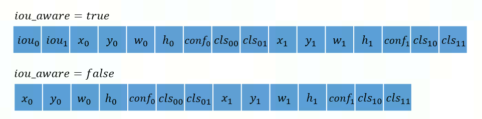
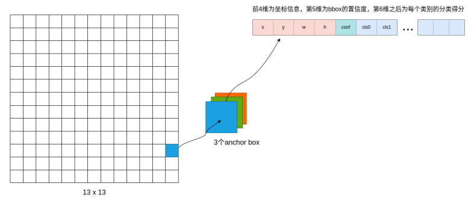
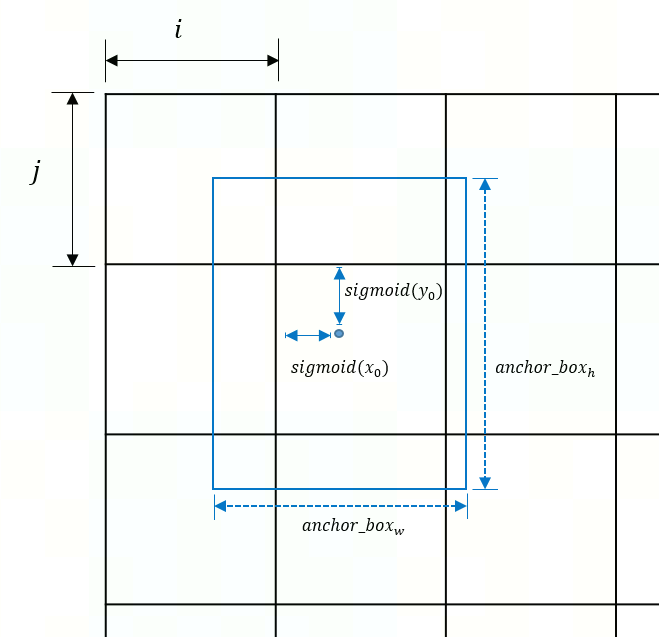
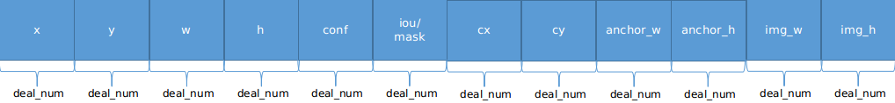
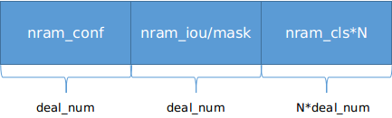
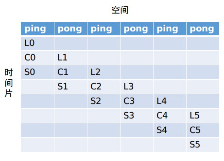

# yolo_box 算子开发设计方案

- #### 文档基本信息

| 算子名称    | yolo_box         |
| --------- | ---------------- |
| 编制人/日期 | 吴少强/2022-8-16 |

- #### 修改记录

| 修订人 | 修订日期   | 修订描述     |
| ----- | --------- | --------   |
| 吴少强 | 2022-8-16 | 首次提交     |
| 王远   | 2023-5-26 | 修复设计文档 |

- #### 内容描述

本文档为`yolo_box`算子的设计文档，包括需求分析、接口设计、方案设计、性能优化记录。

- #### 算子需求 checklist

* 算子接口描述
* 功能描述
* 框架版本 + 对应源码路径
* 需求对应网络
* 网络中用到的规模
* 是否需要支持原位
* 是否需要支持 stride 机制
* 框架单元测试阈值指标（可选）

## 1 需求分析

### 1.1 算子需求分析

| 算子功能简介                                                 | 从检测网络的backbone输出部分，计算真实检测框bounding box信息 |
| :----------------------------------------------------------- | ------------------------------------------------------------ |
| 需求来源                                                     | Paddle                                                       |
| 应用网络                                                     | ppyolo                                                       |
| 输入数据类型                                                 | x: float<br />img_size: int<br />anchors: int                |
| 输入 Shape                                                   | x: [N, C, H, W]<br />img_size: [N, 2]<br />anchors: [2*S]    |
| 输入 Layout                                                  | x: ARRAY<br />img_size: ARRAY<br />anchors: ARRAY            |
| 输入标量参数                                                 | class_num: int<br />conf_thresh: float<br />downsample_ratio: int<br />clip_bbox: bool<br />scale: float<br />iou_aware: bool<br />iou_aware_factor: float |
| 输出数据类型                                                 | float                                                        |
| 输出 Shape                                                   | boxes: [N, S, 4, H\*W]<br />scores: [N, S, class_num, H\*W]  |
| 输出 Layout                                                  | boxes: ARRAY <br />scores: ARRAY                             |
| 模式（可选）                                                  | 否                                                           |
| 是否含有 dim/axis 等类似语义的参数且该参数支持负数/其他特殊处理 | 否                                                           |
| 是否含有 labels/index 等类似语义的参数且该参数支持负数/界外情况/其他特殊处理 | 否                                                           |
| 是否需要支持原位                                             | 否                                                           |
| 是否需要支持 stride 机制                                     | 否                                                           |
| 是否需要支持广播                                             | 否                                                           |
| 0 元素检查是否直接返回                                       | 是 ：<br />输入输出tensor的维度N为0时，返回MLUOP_STATUS_SUCCESS<br />输入x tensor的H或W为0时，返回MLUOP_STATUS_SUCCESS |
| 其他特殊需求(在线量化，融合，转数提前等，可选)               | 无                                                           |
| 本次开发优先支持的规模/模式                                  | 无                                                           |

### 1.2 算子功能和应用场景描述

#### 1.2.1 算子功能

在目标检测模型中，如果对输入特征图（特征图大小对应本文中`img_size`）的每个像素点都生成 `anchor box`，即使是一张特征图所产生的 `anchor box` 也会多到难以承受的地步。因此目标检测模型对特征图进行下采样，得到网格化的特征图（对应本文中`x`的最后两维度的长度）。

通常情况下，每个网格称做特征图的一个`cell`。基于该`cell`，通过 `scale` 等参数生成与特征图长宽成比例的 `anchor box`。为了使得 `anchor box` 中心在与 `cell` 中心点对齐，计算过程中会加 `0.5 cell` 的偏移。每个 `cell` 对应的 `anchor box` 数量相同。

`yolo_box` 算子对每个 `cell` 所对应的固定数个 `anchor box` 的坐标进行还原（从网格坐标还原到特征图坐标），对置信度 `conf` 进行处理。

#### 1.2.2 参数说明


输入张量：
- `x.shape=[N,C,H,W]`，`C` 维度存储每个 `anchor box` 的坐标信息、置信度、分类得分。 `W, H` 指网格划分大小。
- `anchors.shape=[S,2]`，其中 `anchors[i,:],i=0,1,...,S-1` 表示第 `i` 个 `anchor box` 对应的宽和高。对每个 `cell` 给定的预测框的数量记为 `S`。
- `img_size.shape=[N,2]`，其中 `img_size[n,:],n=0,1,...,N-1` 表示第 `n` 个特征图对应的宽和高。

输入标量：
- `iou_aware` 为 `bool` 类型，表示是否使用 `iou`。
- `scale` 为 `anchor box` 中心点坐标的缩放系数。
- `downsample_ratio` 表示从特征图到网格图的下采样率，`yolo` 模型中 `yolo_box` 层一般会将其依次设置为`32,16,8`。

输入张量 `x` 的 `C` 维度大小受 `iou_aware` 影响：
  - `iou_aware==false`时，`C=S*(5+class_num)` ，其中 `5` 表示 `anchor box` 坐标信息：图1中 `x0,y0` 为中心点对应 `cell` 在整个网格图中的偏移值，`w0,h0` 为 `cell` 内的偏移，`conf` 为置信度。后`class_num`个位置存储每一类的分类得分，`class_num>=1`。
  - `iou_aware==true`时，`C=S+S*(5+class_num)=S*(6+class_num)`。相较于`iou_aware==false`，此处在`C`维度头部插入了`S`个`iou`值 。
    - 以 `S=2, class_num=2` 为例，`C` 维度示意图如下（此处数据对应 `x[n,:,i,j], 0<=n<N, 0<=i<H, 0<=j<W,`，图中未体现 `N,H,W` 维度）：

   
    <div align='center' >图1</div>


此处以`x.shape=[N=1, C=3*(5+class_num),H=13, W=13]` 为例，可以看到下图中最左侧为包含了 13*13 个`cell` 的网格, 每个 `cell` 对应 `3` 个 `anchor box`，每个 `anchor box` 包含坐标、置信度、得分等信息。

   
   <div align='center' >图2</div>

#### 1.2.3 计算过程

`yolo_box` 计算过程包含两部分：`anchor_box` 坐标变换（从网格坐标还原至特征图坐标）、置信度处理。

**计算 boxes：**

`anchor box` 坐标变换分为解码、转换、裁剪三步，以图1中 `iou_aware=false` 第一组坐标数据（对应`x[n,0:5,i,j]`）为例，示意图如下所示

  <div align='center' >
      
  </div>
  <div align='center' >图3</div>


   1. 解码：

      ```math
      \begin{aligned}
         center_{x} & = (sigmoid(x_{0})*scale + bias + i) * img\_size_{w} / W \\
         center_{y} & = (sigmoid(y_{0})*scale + bias + j) * img\_size_{h} / H \\
         center_{w} & = anchors_{w} * e^{w_{0}}* img\_size_{w} / (downsample\_ratio * W) \\
         center_{h} & = anchors_{h} * e^{h_{0}}* img\_size_{h} / (downsample\_ratio * H) \\
      \end{aligned}
      ```

      此处使用 `simgoid` 处理 x<sub>0</sub>、y<sub>0</sub>，将取值限定在 0~1：
      - bias = -0.5 * (scale - 1)，表示 `anchor box` 中心点坐标的偏移量
      - center<sub>x</sub>、center<sub>y</sub>、center<sub>w</sub>、center<sub>h</sub> 为特征图中 `anchor box` 的中心点坐标、宽、高。

   2. 计算左下、右上点坐标（转换）：

      ```math
      \begin{aligned}
         box_{lx} & = center_{x} - center_{w} / 2 \\
         box_{ly} & = center_{y} - center_{h} / 2 \\
         box_{rx} & = center_{x} + center_{w} / 2 \\
         box_{ry} & = center_{y} + center_{h} / 2 \\
      \end{aligned}
      ```

   3. 裁剪：

      如果`clip_bbox==true`，则将输出坐标裁剪到 `img_size` 范围内。

      ```math
      \begin{aligned}
         box_{lx} & = box_{lx} > 0 ? box_{rx} : 0 \\
         box_{ly} & = box_{ly} > 0 ? box_{ly} : 0 \\
         box_{rx} & = box_{rx} < (img\_size_{w} - 1) ? box_{rx} : img\_size_{w} - 1 \\
         box_{ry} & = box_{ry} > (img\_size_{h} - 1) ? box_{ry} : img\_size_{h} - 1 \\
      \end{aligned}
      ```

      一个 `anchor box` 计算得出一组左上、右下坐标数据，最终输出 `boxes.shape=[N,S*4,H,W]`。

      此外，当 `anchor box` 置信度得分 score<sub>conf</sub> 小于 conf_thresh 时，对应坐标数据均为 `0`。


**计算 scores ：**

   ```math
   score_{conf} =
      \begin{cases}
      conf,                            & iou\_aware==false \\
      conf^{1-iou\_aware\_factor}*iou, & otherwise
   \end{cases}
   ```

   其中，`iou, conf` 计算公式如下所示

   ```math
   iou = simgoid(iou_{0})^{iou\_aware\_factor}
   ```

   ```math
   conf = simgoid(conf_{0})
   ```

   最终该 `anchor box` 对应的 `cls_0,0` 的得分为：

   ```math
   score = score_{conf}*sigmoid(cls_{0,0})
   ```

   一个 `anchor box` 计算得出 `class_num` 个分类得分，`scores.shape=[N,S*class_num,H,W]`。

   此外，当置信度得分 score<sub>conf</sub> 小于 conf_thresh 时，对应的`class_num` 个分类得分均为 `0`。

### 1.3 算子输入输出参数要求

| 参数             | 语义                                                         | 类型（输入/输出） | 支持类型                | 物理布局 | 规模限制 |
| ---------------- | ------------------------------------------------------------ | ----------------- | ----------------------- | -------- | -------- |
| handle           | 当前可获得的资源（context）                                  | 输入              | mluOpHandle_t           | /        | 无       |
| x_desc           | 对输入数据 x 的形状描述，包含了 x 的数据类型、数据维度和布局等信息 | 输入              | mluOpTensorDescriptor_t | /        | 见1.4    |
| x                | 输入 tensor x 的地址，包含每个网格中框的坐标、置信度、分类得分等信息 | 输入              | float                   | ARRAY    | 无       |
| img_size_desc    | 对输入数据 img_size 的形状描述，包含了 img_size 的数据类型、数据维度和布局等信息 | 输入              | mluOpTensorDescriptor_t | /        | 见1.4    |
| img_size         | 输入 tensor img_size 的地址，包含输入图像的宽和高            | 输入              | int                     | ARRAY    | 无       |
| anchors_desc     | 对输入数据 anchors 的形状描述，包含了 anchors 的数据类型、数据维度和布局等信息 | 输入              | mluOpTensorDescriptor_t | /        | 见1.4    |
| anchors          | anchor的宽度和高度                                           | 输入              | int                     | ARRAY    | 无       |
| class_num        | 要预测的类别数，class_num>0                                  | 输入              | int                     | /        | 无       |
| conf_thresh      | 检测框的置信度得分阈值，置信度得分低于阈值的框应该被忽略     | 输入              | float                   | /        | 无       |
| downsample_ratio | 从网络输入到yolo_box操作输入的下采样率，因此应依次为第一个，第二个和第三个yolo_box运算设置该值为32,16,8 | 输入              | int                     | /        | 无       |
| clip_bbox        | 是否将输出的bbox裁剪到 img_size 范围内，默认为True           | 输入              | bool                    | /        | 无       |
| scale            | 放缩解码边界框的中心点，默认值：1.0                          | 输入              | float                   | /        | 无       |
| iou_aware        | 是否使用iou aware因子，默认值false                           | 输入              | bool                    | /        | 无       |
| iou_aware_factor | iou aware因子，默认值0.5                                     | 输入              | float                   | /        | iou_aware为true时，iou_aware_factor要求属于[0, 1]       |
| boxes_desc       | 对输出数据 boxes 的形状描述，包含了 boxes 的数据类型、数据维度和布局等信息 | 输入              | mluOpTensorDescriptor_t | /        | 见1.4    |
| boxes            | 输出 tensor boxes 的地址，保存每个框的左上角和右下角的坐标   | 输出              | float                   | ARRAY    | 无       |
| scores_desc      | 对输出数据  scores 的形状描述，包含了 scores 的数据类型、数据维度和布局等信息 | 输入              | mluOpTensorDescriptor_t | /        | 见1.4    |
| scores           | 输出 tensor scores 的地址，保存每个框中每个类别的最终得分    | 输出              | float                   | ARRAY    | 无       |

### 1.4 算子限制

| 限制类型     | 详细说明                                                     |
| ----------- | ---------------------------------------------------------- |
| 数据类型限制 | x 仅支持 `float`                                             |
| 布局限制     | x、img_size、anchors、boxes、scores 仅支持 ARRAY              |
| 规模限制     | `anchors.shape=[2*S]`，`S` 须大于0，且 S % 2 == 0<br />`x.shape=[N,C,H,W]`，C须大于0<br />img_size的shape为`[N, 2]`，dim[1]为2<br />boxes的shape为`[N, S, 4, H*W]`，dim[1]==S，dim[2]须为4<br />scores的shape为`[N, S, class_num, H*W]`，dim[1]==S，dim[2]须为class_num<br />class_num须大于0且在200平台上小于1535，在300平台上小于2559，此处class_num的取值上限由NRAM空间大小决定，计算公式：(MAX_NRAM_SIZE / sizeof(float) / 2 / 32) - 2 （见scores空间划分）|
| 功能限制     | 无限制                                                       |
| 数据范围限制 | 当 `iou_aware` 为 `true` 时，`iou_aware_factor` 的范围为 [0, 1] <br>`x` 受真值影响，部分值有指数运算，会与竞品对不齐                           |
| 原位限制     | 不支持原位                                                   |
| stride 限制  | 不支持 stride 机制                                           |
| 广播限制     | 不支持广播                                                   |

### 1.5 验收标准

#### 1.5.1 精度验收标准

按照[精度验收标准](../MLU-OPS-Accuracy-Acceptance-Standard.md)的要求明确本算子的精度标准。

本算子属于复合类算子，验收标准为 diff1 <= 3e-3 && diff2 <= 3e-3

#### 1.5.2 性能验收标准

- 参考接口性能分析

  | 平台                 | 框架版本 | 数据类型 | 规模                                                         | 计算效率  | IO效率  | Hardware Time（us） |
  | :------------------- | :------- | :------- | :----------------------------------------------------------- | :-------- | :------ | :------------------ |
  | Tesla V100-SXM2 16GB | paddle   | float    | img_size=[8, 2]<br />x=[8, 255, 19, 19]<br />anchors[6]<br />class_num=80 | 4.080262% | 26.336% | 70.9472             |
  | Tesla V100-SXM2 16GB | paddle   | float    | img_size=[8, 2]<br />x=[8, 255, 38, 38]<br />anchors[6]<br />class_num=80 | 3.62%     | 23.285% | 316.387             |
  | Tesla V100-SXM2 16GB | paddle   | float    | img_size=[8, 2]<br />x=[8, 255, 76, 76]<br />anchors[6]<br />class_num=80 | 1.2599%   | 18.447% | 3592.198            |

  - 网络中使用到的规模性能优于或至少与参考接口性能持平。
  - 部分与参考接口差距过大的规模在4.算子性能优化记录中进行说明。
  - 附上算子测试报告链接，测试报告必须包括框架给出的网络中规模的性能数据以及对应效率值。

## 2 算子接口设计

### 2.1 参考接口

```c++
// https://github.com/PaddlePaddle/Paddle/blob/abbc33925cfc132ce1a1400cf1df179c8f62c049/paddle/phi/kernels/funcs/yolo_box_util.h
template <typename T, typename Context>
void YoloBoxKernel(const Context& dev_ctx,
                   const DenseTensor& x,
                   const DenseTensor& img_size,
                   const std::vector<int>& anchors,
                   int class_num,
                   float conf_thresh,
                   int downsample_ratio,
                   bool clip_bbox,
                   float scale_x_y,
                   bool iou_aware,
                   float iou_aware_factor,
                   DenseTensor* boxes,
                   DenseTensor* scores);
```

### 2.2 接口设计

```c++
mluOpsStatus_t MLUOP_WIN_API
mluOpYoloBox(mluOpHandle_t handle,
             const mluOpTensorDescriptor_t x_desc,
             const void *x,
             const mluOpTensorDescriptor_t img_size_desc,
             const void *img_size,
             const mluOpTensorDescriptor_t anchors_desc,
             const void *anchors,
             const int class_num,
             const float conf_thresh,
             const int downsample_ratio,
             const bool clip_bbox,
             const float scale,
             const bool iou_aware,
             const float iou_aware_factor,
             const mluOpTensorDescriptor_t boxes_desc,
             void *boxes,
             const mluOpTensorDescriptor_t scores_desc,
             void* scores);
```

## 3 实现方案设计

### 3.1 实现方案

该算子包含三个输入 `tensor`:
- `x.shape=[N,C,H,W]`；
- `anchors.shape=[S,2]`；
- `img_size.shape=[N,2]`。


两个输出 `tensor`:
- `boxes.shape=[N, S, 4, H*W]`；
- `scores.shape=[N, S, class_num, H*W]`。

由于参与坐标计算和分类得分计算的数据彼此独立，因此实现两个功能函数，分别完成 `boxes` 和 `scores` 的计算，两个功能函数均含有独立流水：

#### 3.1.1 计算boxes

1. 拆分逻辑

`boxes` 空间划分:



对`H*W` 进行拆分，每个`core` 处理数据量为 `N * C * hw_per_core`，`C` 维度表现为对 `S` 的拆分。 ；

```c++
const int32_t hw_per_core = (H*W) / taskDim + (tasdId < int32_t((H*W) % taskDim));
```

1.2.3 小节提到当 `anchor box` 置信度得分 score<sub>conf</sub> 小于 `conf_thresh` 时，对应坐标数据均为 `0`。因此预处理阶段使用 `fill` 算子对 `boxes` 进行刷 `0` 操作。

根据空间划分，一个`core` 一次能处理的最大数据量为`deal_num`：
- `deal_num >= (N * S * hw_per_core)`时，一次可以处理整个`[N, S, hw_per_core]`；
- `deal_num >= (S * hw_per_core) && deal_num<(N * S * hw_per_core)`时，一次至少可以处理一个`[S, hw_per_core]`，外层拆分 `N`；
- `deal_num >= (hw_per_core) && deal_num<(S*hw_per_core)`时，一次至少可以处理一个`[hw_per_core]`的数据，外层拆`N*S`；
- `deal_num < (hw_per_core)`时，表示一次无法处理整个`[hw_per_core]`，外层循环遍历 `N*S`，内层拆分 `hw_per_core`。


1. 初始化`cx、cy`，`load` `x、conf`等数据

```c
// hw 为 x.shape[:,:,H,W] 中 HW 维度的下标，为当前 core 处理的 HW 位置起始点横坐标
cy = [hw/W, (hw+1)/W, (hw+2)/W, ..., (hw+deal_num-1)/W];
cx = [hw%W, (hw+1)%W, (hw+2)%W, ..., (hw+deal_num-1)%W];
```

3. 拆分 `deal_num`，循环完成 `boxes` 计算

```c++
typedef enum {
   PARTITION_N = 0,
   PARTITION_NS = 0,
   PARTITION_NSHW = 0,
} yoloBoxPartitionMode_t;

const yoloBoxPartitionMode_t mode = PARTITION_N;
int32_t n_repeat,          s_repeat,         hw_repeat;
int32_t n_rem = 0,         s_rem = 0,        hw_rem = 0;
int32_t n_deal_once = 1,   s_deal_once = 1;

if (mode == yoloBoxPartitionMode_t::PARTITION_N) {
   // 拆N
   // 一次处理数据中包含完整的S、hw_per_core
   n_deal_once = deal_num / (S * hw_per_core);
   n_repeat = N / n_deal_once;
   n_rem = N % n_deal_once;

   s_repeat = 1;
   hw_repeat = 1;
} else if (mode == yoloBoxPartitionMode_t::PARTITION_NS) {
   // 拆S
   // 一次处理数据中包含整个 hw_per_core
   s_deal_once = deal_num / hw_per_core;
   s_repeat = S / s_deal_once;
   s_rem = S % s_deal_once;

   n_repeat = 1;
   hw_repeat = 1;

} else {
   // 拆HW
   n_repeat = 1;
   s_repeat = 1;

   hw_repeat = deal_num / hw_per_core;
   hw_rem = deal_num % hw_per_core;
}

// 循环完成数据处理
for(int32_t n = 0; n < n_repeat + 1; ++n) {
   const int32_t deal_n = n < n_repeat ? n_deal_once : n_rem;

   for (int32_t s = 0; s < s_repeat + 1; ++s) {
      const int32_t deal_s = s < n_repeat ? n_deal_once : n_rem;

      for (int32_t hw = 0; hw < hw_repeat + 1; ++hw) {
         const int32_t deal_hw = hw < hw_repeat ? n_deal_once : hw_rem;

         compute(/* params */);
      }
   }
}
```

#### 3.1.1 计算 scores

1. 拆分逻辑



根据空间划分，一个`core` 一次能处理的最大数据量为`deal_num`，`C` 维度表现为对 `S` 的拆分。

- 当 `deal_num >= (N * S * hw_per_core)`时，一次可以处理`[N, S, hw_per_core]` 大小的数据；
- 当 `deal_num >= (S * hw_per_core) && deal_num<(N * S * hw_per_core)`时，一次至少可以处理`[S, hw_per_core]` 大小的数据，外层拆分 `N`；
- 当 `deal_num >= (hw_per_core) && deal_num<(S*hw_per_core)`时，一次至少可以处理一个`[hw_per_core]`的数据，外层拆分 `N`，内层拆 `S`；
- 当 `deal_num < (hw_per_core)`时，外层循环遍历 `N*S`，内层拆分处理 `hw_per_core`。

`scores` 计算过程与 `boxes` 计算过程相同，仅 `compute` 存在区别，此处不再赘述。

### 3.2 伪代码实现（可选）

无

### 3.3 拆分(任务拆分，多核拆分)

- 基本任务类型为BLOCK任务；
- 任务间拆`HW`维度；同一任务内，拆`N`、`NS`、`NSHW`。详见 3.1 节。

### 3.4 性能优化设计

1、资源分配

| 表项            | 分配策略                                                     |
| --------------- | ------------------------------------------------------------ |
| NRAM            | 计算boxes时：NRAM 划分为ping\pong两大部分，其中每一部分划分见3.1实现方案<br />计算scores时：NRAM 划分为ping\pong两大部分，其中每一部分划分见3.1实现方案 |
| WRAM            | 未使用                                                       |
| SRAM            | 未使用                                                       |
| DRAM(workspace) | 未使用                                                       |

2、流水设计



- boxes计算流水：采用三级流水设计，`LCS` 为 GDRAM2NRAM、Compute、NRAM2GDRAM。

- scores计算流水：采用三级流水设计，`LCS` 为 GDRAM2NRAM、Compute、NRAM2GDRAM。

### 3.5 可维护性设计

1. bangc 代码中加入必要的 log 信息，比如输入的规模、数据类型、layout 这些，以及如果出错会导致程序 core dump 的变量，比如 IO 指令的 data_size、dim xyz 的值等，这些信息都是有利于快速定位问题；
2. 对每一个函数命名变量命名都有充分的注释；
3. 避免魔鬼数字，对于确定的数字尽量使用公共宏来替代。

### 3.6 测试用例设计

- 算子在网络中用到的规模：
  - case1
    - input tensor：ImgSize=[8, 2], X=[8, 255, 19, 19],
    - output tensor：Boxes=[8, 1083, 4], Scores=[8, 1083, 80]

  - case2
    - input tensor：ImgSize=[8, 2], X=[8, 255,  38, 38],
    - output tensor：Boxes=[8, 4332, 4], Scores=[8, 4332, 80]

  - case3
    - input tensor：ImgSize=[8, 2], X=[8, 255,  76, 76],
    - output tensor：Boxes=[8, 17328, 4], Scores=[8, 17328, 80]


其他可根据需要进行补充。算子开发完毕后，补充测试报告链接。

### 3.7 算子防呆检查

1. 描述符指针为空防呆：handle、x_desc、 img_size_desc、anchors_desc、boxes_desc、scores_desc；
2. 0 元素检查防呆；
3. 对输入输出支持的 dtype、layout 以及 shape 进行防呆；
4. 指针为空防呆：x、img_size、anchors、boxes、scores；
5. iou_aware_factor 防呆。

## 4 算子性能优化记录

无

### 4.1 当前存在问题的规模说明

无

| 提交日期 | 问题规模 | 问题描述 | 是否已修复 |
| -------- | -------- | -------- | ---------- |
|          |          |          |            |

### 4.2 已经过优化的规模说明

无

| 提交日期 | 修复规模 | 修复问题 |
| -------- | -------- | -------- |
|          |          |          |
