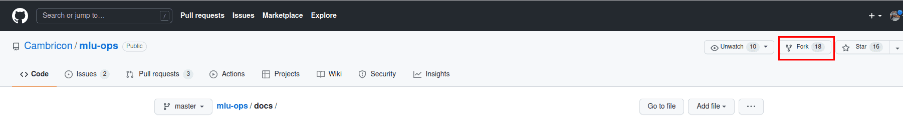
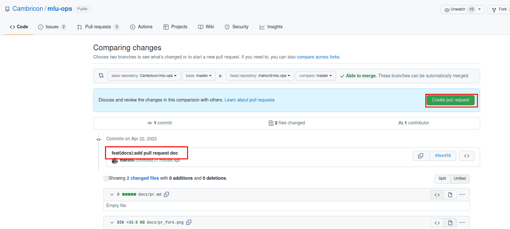

# 拉取请求
## 什么是拉取请求

拉取请求 (Pull Request)，GitHub 官方文档定义如下。
```
拉取请求是一种通知机制。你修改了他人的代码，将你的修改通知原来作者，希望他合并你的修改。
```
## 基本的工作流：
```
１．获取最新的代码库
２．从主分支 fork 一份代码进行开发
３．提交修改
４．推送你的修改并创建一个 拉取请求
５．讨论、审核代码
６．将开发分支合并到主分支
```
## 具体步骤 

1.获取最新的代码库

- 第一次提交pr时,先fork mlu-ops仓库 


- 把fork的代码下载到本地
```
git clone https://github.com/你的github用户名/mlu-ops.git
```
- 添加原代码库为上游代码库
```
git remote add upstream https://github.com/Cambricon/mlu-ops.git
```
- 从第二个PR起检出本地代码库的主分支，然后从最新的原代码库的主分支拉取更新
```
git checkout master
git pull upstream master 
代码库中拉取最新的master代码 
```

2.提交修改代码
```
//把修改的文件添加到仓库
git add [files]  
git commit -m "messages"  
```

3.推送修改到fork的代码库，并创建一个拉取请求
- 推送当前分支到fork的代码库
```
git push origin branchname(分支名)
```
- 创建一个拉取请求


- 根据评审人员的意见修改代码，并推送修改

## pr规范

- 使用pre-commit hook，尽量减少代码风格相关问题
- 一个PR对应一个短期分支粒度要细，一个PR只做一件事情，避免超大的PR
- 每次Commit时需要提供清晰且有意义commit信息
- 提供清晰且有意义的拉取请求描述
标题写明白任务名称，一般格式:[Prefix] Short description of the pull request (Suffix)
prefix: 新增功能[feature]，修bug[Fix]，文档相关[Docs]， 开发中[WIP] (暂时不会被review)
描述里介绍拉取请求的主要修改内容，结果，以及对其他部分的影响，参考拉取请求模板
- 关联相关的议题 (issue) 和其他拉取请求
