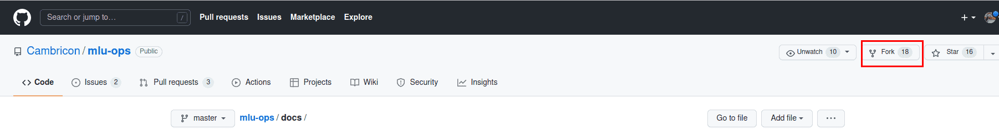
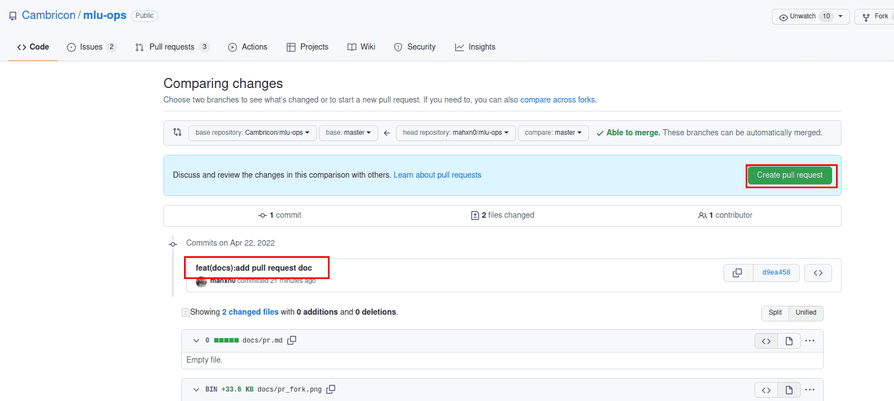

## 拉取请求
### 什么是拉取请求？
`拉取请求`PR（Pull Request），GitHub官方文档定义如下。

```
拉取请求是一种通知机制。你修改了他人的代码，将你的修改通知原来作者，希望他合并你的修改。
```


### 基本的工作流：

1. 获取最新的代码库

2. 从主分支创建最新的分支进行开发

3. 提交修改

4. 推送你的修改并创建一个拉取请求

5. 讨论、审核代码

6. 将开发分支合并到主分支

   

### 具体步骤 

#### 1.获取最新的代码库

- 当第一次提交PR时

  复刻Mlu-ops原代码库，点击GitHub界面右上角的Fork按钮即可

   

  克隆复刻的代码库到本地		

```bash
git clone https://github.com/yourname/mlu-ops.git
```

​		添加原代码库为上游代码库

```bash
git remote add upstream https://github.com/Cambricon/mlu-ops.git
```
- 从第二个PR起

  检出本地代码库的主分支，然后从最新的原代码库的主分支拉取更新
```bash
git checkout master
git pull upstream master 
```

#### 2.从主分支创建一个新的开发分支

```bash
git checkout -b yourbranch
```

```{tip}
为了保证提交历史清晰可读，我们强烈建议您先检出主分支（master），再创建新的分支。
```

#### 3.提交你的修改

```bash
#coding
git add [files]
git commit -m "messages"
```

#### 4.推送你的修改到复刻的代码库，并创建一个`拉取请求`

- 推送当前分支到远端复刻的代码库
```
git push origin yourbranch
```
- 创建一个`拉取请求`


#### 5.讨论并评审你的代码

+ 创建`拉取请求`后，可以关联相关人员进行评审
+ 根据评审意见修改代码，并推送修改

#### 6.`拉取请求`合并之后删除该分支

```bash
git branch -d yourbranch  #delete local branch
git push origin --delete yourbranch # delete remote branch
```


### pr规范

1. 尽量减少代码风格相关问题

2. 一个 PR 对应一个短期分支

3. 粒度要细，一个PR只做一件事情，避免超大的PR
    - Bad：给Mlu-ops添加一个Add算子
    - Acceptable：给Add算子添加一个接口
    - Good：给接口添加一个是否支持Half类型的参数

4. 每次Commit时需要提供清晰且有意义的commit信息

5. 提供清晰且有意义的`拉取请求`描述

    - 标题写明白任务名称，一般格式:[Prefix] Short description of the pull request （Suffix）

    - prefix: 新增功能[Feature]，修bug[Fix]，文档相关[Docs]，开发中[WIP]（暂时不会被review）

    - 描述里介绍`拉取请求`的主要修改内容，结果，以及对其他部分的影响

    - 关联相关的`议题`（issue）和其他`拉取请求`

